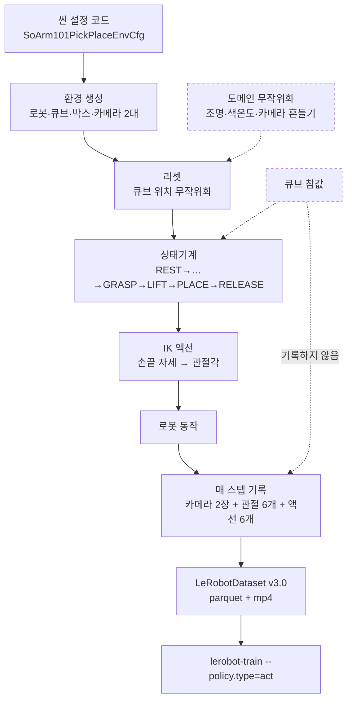

# Isaac Sim에서 ACT 학습 데이터 만들기 — 남은 5단계

```
읽는 대상   Isaac Sim에서 SO-ARM101 씬까지는 만들었지만, 그 씬으로 어떻게
            학습 데이터가 나오는지 아직 안 잡히는 상태
다 읽으면   남은 5개 작업이 각각 무엇을 해결하는지, 왜 그 순서인지,
            GUI에서 잰 값이 코드 어디로 들어가는지
필요 지식   없습니다. Isaac Lab·LeRobot을 몰라도 읽히도록 썼습니다
분량        약 15분
```

---

## 1. 문제 장면 — 씬은 만들었는데 데이터가 안 나옵니다

Isaac Sim을 켜면 로봇이 있고, 큐브가 있고, 박스가 있고, 카메라 두 대가 제자리를 봅니다. 눈으로 보기엔 다 됐습니다.

그런데 **Play를 눌러도 아무 일이 안 일어납니다.** 팔은 가만히 있고, 큐브도 그대로입니다. 당연합니다. 씬은 무대일 뿐이고, **배우도 대본도 촬영기사도 없기 때문입니다.**

ACT는 모방학습입니다. 사람이 시범을 보인 데이터를 흉내 내며 배웁니다. 그러니 학습을 시키려면 먼저 **시범 데이터가 있어야** 합니다. 지금 없는 것이 정확히 그것입니다.

> **핵심 질문** — 시뮬레이션 안에서 픽앤플레이스 시범을 **누가** 보여주고, 그걸 **누가** 기록합니까?

리더 암으로 직접 조작하는 방법이 있지만, 지금 로봇이 손에 없습니다. 그래서 **사람 대신 프로그램이 시범을 보이는** 경로로 갑니다. 남은 5단계가 그 경로를 까는 작업입니다.

---

## 2. 그래서 무엇이 필요한가

다섯 개가 필요하고, 각각 없으면 무엇이 깨지는지가 분명합니다.

| # | 부품 | 없으면 |
|---|---|---|
| 1 | **씬 설정 코드** (`SoArm101PickPlaceEnvCfg`) | 학습용 병렬 환경을 못 만듭니다. GUI 씬은 한 벌뿐입니다 |
| 2 | **PLACE·RELEASE 상태** | 큐브를 들기만 하고 **박스에 넣지 않습니다**. 픽앤"플레이스"가 안 됩니다 |
| 3 | **IK 액션** | 상태기계가 "물체 위 10cm"라고 말해도 로봇이 못 알아듣습니다 |
| 4 | **기록 스크립트** | 시범이 화면에만 흐르고 **파일로 안 남습니다** |
| 5 | **도메인 무작위화** | 항상 같은 조명·같은 배치만 배워서 실물에서 무너집니다 |

**1번이 나머지 넷의 토대입니다.** 2·3번은 시범을 만드는 쪽, 4번은 받아 적는 쪽, 5번은 다양성을 넣는 쪽입니다.

---

## 3. 시범은 사람이 아니라 상태기계가 보입니다

Isaac Lab에 이미 들어 있는 예제가 출발점입니다.

```
D:\ic\IsaacLab\scripts\environments\state_machine\lift_cube_sm.py
```

큐브를 집어 올리는 동작을 **유한 상태기계**로 짜둔 코드입니다. 다섯 상태를 순서대로 지나갑니다.

```
REST → APPROACH_ABOVE_OBJECT → APPROACH_OBJECT → GRASP_OBJECT → LIFT_OBJECT
```

물체 위 10cm로 접근하고(`offset[:, 2] = 0.1`), 내려가고, 그리퍼를 닫고, 목표 위치로 들어 올립니다. Warp 커널로 짜여 있어 수십~수백 환경에서 **동시에** 돕니다.

**이 상태기계는 큐브의 정확한 좌표를 봅니다.** 시뮬레이션 안에서는 물리 엔진에게 물어보면 공짜로 나오는 값입니다.

> ### 비유
>
> 시험 감독관이 답안지를 들고 있습니다. 감독관은 정답을 알기 때문에 **완벽한 풀이 과정을 칠판에 시범으로 보여줄 수 있습니다.**
>
> 하지만 학생에게 나눠주는 것은 **문제지뿐**입니다. 답안지는 주지 않습니다. 학생은 문제만 보고 푸는 법을 익혀야 합니다.
>
> 상태기계가 감독관이고, ACT가 학생입니다. 상태기계는 큐브 좌표(답안지)를 보고 움직이지만, **데이터셋에 기록되는 것은 카메라 그림과 관절값(문제지)뿐**입니다.

이 구조가 중요한 이유가 있습니다. 실물 로봇에는 큐브 좌표를 알려줄 방법이 없습니다. 그런데 ACT가 **카메라 그림만으로 푸는 법**을 배웠다면, 실물에서도 그대로 돌아갑니다. 답안지는 시뮬 안에서만 쓰이고 밖으로 나가지 않습니다.

---

## 4. 전체 구조

다섯 부품이 파이프라인의 어디에 들어가는지 그림으로 보면 이렇습니다.



**점선이 중요합니다.** 큐브 참값은 상태기계로만 들어가고 기록으로는 가지 않습니다. 도메인 무작위화는 리셋 시점에만 개입합니다.

마지막 줄이 눈에 익으실 겁니다. **지금 실물 데이터로 돌리고 있는 그 명령과 똑같습니다.** 데이터 출처만 바뀌고 학습 절차는 그대로입니다.

---

## 5. 다섯 단계, 하나씩

### 5-1. 씬 설정 코드 — GUI에서 잰 값을 코드로 옮깁니다

Isaac Lab은 학습할 때 **씬을 코드로 새로 만듭니다.** GUI에서 저장한 `so101.usd`를 그대로 읽어 쓰는 게 아닙니다.

이상하게 들리지만 이유가 있습니다. 학습은 환경 수십~수백 개를 동시에 돌리는데, GUI 씬은 한 벌뿐입니다. 코드로 정의해야 **복제**할 수 있습니다.

그래서 **GUI는 값을 재는 자(ruler) 역할**입니다. 눈으로 맞춰보고 좌표를 뽑아 코드에 적습니다.

넣을 값은 이미 다 나와 있습니다.

| 항목 | 값 | 어떻게 얻었나 |
|---|---|---|
| 로봇 | `SO_ARM101_CFG` | `isaac_so_arm101` 저장소 |
| 큐브 초기위치 | `(0.26952, 0.01178, 0.015)` | GUI 4모서리 중심 |
| 큐브 크기 | 한 변 30mm | `scale 0.03` |
| 무작위화 | `x ±0.094`, `y ±0.072` | GUI 4모서리 |
| 박스 | AABB `x 0.194~0.301`, `y −0.159~−0.085` | USD에서 직접 읽음 |
| **front_cam** | pos `(0.01349, −0.07127, 0.02346)`<br/>quat `(0.977067, 0.212923, 0.001920, −0.000339)` | GUI 정렬 후 USD 읽기 |
| **top_cam** | pos `(0.58523, 0.07394, 0.40000)`<br/>quat `(0.976647, −0.134580, 0.166727, −0.015871)` | 같음 |
| 카메라 광학 | focal `8.48`, h_ap `20.955`, v_ap `15.716`, near `0.01` | U20CAM 매뉴얼 FOV-H 102° |
| 해상도 | 640 × 480 | 실물 데이터셋과 동일 |

카메라는 이런 모양이 됩니다.

```python
front_cam = TiledCameraCfg(
    prim_path="{ENV_REGEX_NS}/Robot/gripper_link/front_cam",
    offset=TiledCameraCfg.OffsetCfg(
        pos=(0.01349, -0.07127, 0.02346),
        rot=(0.977067, 0.212923, 0.001920, -0.000339),
        convention="opengl",
    ),
    spawn=sim_utils.PinholeCameraCfg(
        focal_length=8.48,
        horizontal_aperture=20.955,
        vertical_aperture=15.716,
        clipping_range=(0.01, 100.0),
    ),
    width=640, height=480, data_types=["rgb"],
)
```

`{ENV_REGEX_NS}`가 복제를 담당하는 자리표시자입니다. 환경 0번은 `/World/envs/env_0/Robot/...`, 1번은 `env_1/...`로 자동으로 펼쳐집니다.

**`TiledCameraCfg`를 쓰는 이유** — 일반 `CameraCfg`는 환경마다 따로 렌더링해서 환경 수만큼 느려집니다. Tiled는 여러 환경을 한 장에 타일처럼 붙여 한 번에 렌더링합니다.

---

### 5-2. PLACE·RELEASE 상태 — 지금은 들기만 하고 끝납니다

예제 상태기계의 마지막 상태가 `LIFT_OBJECT`입니다. 큐브를 목표 높이까지 들어 올리면 **거기서 멈춥니다.**

우리가 필요한 것은 픽앤**플레이스**입니다. 박스에 넣어야 합니다. 그래서 상태를 이어 붙입니다.

```
기존:  REST → APPROACH_ABOVE → APPROACH → GRASP → LIFT
추가:                                              ↓
       MOVE_ABOVE_BOX → LOWER_INTO_BOX → RELEASE → RETREAT
```

| 추가 상태 | 하는 일 | 그리퍼 |
|---|---|---|
| `MOVE_ABOVE_BOX` | 박스 위 10cm로 이동 | 닫음 |
| `LOWER_INTO_BOX` | 박스 안으로 하강 | 닫음 |
| `RELEASE` | 큐브를 놓음 | **염** |
| `RETREAT` | 위로 빠져나옴 | 열림 |

`RELEASE`가 없으면 어떻게 될까요. 그리퍼가 큐브를 쥔 채 에피소드가 끝납니다. **ACT는 "잡고 안 놓는 것"을 정답으로 배웁니다.** 실기에서도 놓지 않습니다.

`RETREAT`도 빼면 안 됩니다. 놓자마자 멈추면 그리퍼가 박스 안에 머문 그림으로 끝나서, 정책이 마무리 동작을 못 배웁니다.

코드는 Warp 커널의 `if state == ...` 분기를 네 개 더 붙이는 형태입니다. 기존 다섯 개와 구조가 같아서 패턴을 그대로 따라가면 됩니다.

---

### 5-3. IK 액션 — 상태기계의 말을 로봇이 알아듣게

상태기계가 내놓는 명령은 **"손끝을 (x, y, z, 회전)으로 보내라"**입니다. 관절을 몇 도로 돌리라는 말이 아닙니다.

그런데 지금 `SoArm101LiftCubeEnvCfg`의 액션은 `JointPositionActionCfg` — **관절각을 직접 받는** 방식입니다. 말이 안 통합니다.

> ### 비유
>
> 내비게이션에 목적지 주소를 찍는 것과, 핸들을 몇 도 꺾고 언제 가속할지를 일일이 지시하는 것의 차이입니다.
>
> 상태기계는 주소를 찍습니다. 그러니 주소를 받아 핸들 조작으로 바꿔주는 장치가 필요합니다. 그 장치가 **역기구학(IK)**입니다.

Isaac Lab에 이미 들어 있습니다.

```
isaaclab/envs/mdp/actions/actions_cfg.py:263  DifferentialInverseKinematicsActionCfg
isaaclab/controllers/differential_ik.py:18    DifferentialIKController
```

액션 설정을 이걸로 바꾸면 됩니다. 예제 `lift_cube_sm.py`가 쓰는 환경 이름이 `Isaac-Lift-Cube-Franka-**IK-Abs**-v0`인 것도 같은 이유입니다.

**그리퍼는 별개입니다.** 팔은 IK로 가고, 그리퍼는 열림/닫힘 명령을 따로 받습니다.

---

### 5-4. 기록 스크립트 — 시범을 파일로 남깁니다

시범이 화면에서 아무리 잘 돌아도 저장하지 않으면 학습에 못 씁니다.

LeRobot이 쓰기 API를 제공합니다. 설치된 패키지에서 확인했습니다.

```
lerobot/datasets/lerobot_dataset.py:684  LeRobotDataset.create()
lerobot/datasets/lerobot_dataset.py:418  add_frame()
lerobot/datasets/lerobot_dataset.py:434  save_episode()
```

매 스텝 이런 딕셔너리를 넣어주면 됩니다.

```python
dataset.add_frame({
    "observation.images.front": front_rgb,   # (480, 640, 3)
    "observation.images.top":   top_rgb,
    "observation.state":        joint_pos,   # 6개
    "action":                   joint_target,# 6개
})
```

**필드 이름을 실물 데이터셋과 똑같이 맞추는 것이 중요합니다.** 실물 데이터셋 `meta/info.json`에 이렇게 적혀 있습니다.

```
action, observation.state       : 6차원
  shoulder_pan, shoulder_lift, elbow_flex, wrist_flex, wrist_roll, gripper
observation.images.front / top  : 480 × 640 × 3, 30fps, h264
```

이름이 하나라도 다르면 나중에 두 데이터셋을 비교하거나 섞을 때 어긋납니다.

**여기서 답안지를 흘리면 안 됩니다.** 큐브 좌표를 `observation`에 넣고 싶은 유혹이 있지만, 넣는 순간 정책이 그걸 보고 풀어버립니다. 실기에는 그 값이 없으니 정책이 무너집니다.

---

### 5-5. 도메인 무작위화 — 조명이 바뀌어도 되게

지금 이대로 데이터를 모으면 **항상 같은 조명, 같은 카메라 각도**입니다. 그 조건에서만 잘하는 정책이 됩니다.

집 작업실 조명과 다른 곳의 조명이 같을 리 없습니다. 카메라도 다시 달면 몇 mm씩 어긋납니다.

NVIDIA 공식 강좌가 쓰는 범위를 그대로 출발점으로 잡습니다.

| 대상 | 파라미터 | 범위 |
|---|---|---|
| 조명 | `exposure` | **−4.0 ~ 3.0** |
| 조명 | `temperature` | **2500 ~ 9500 K** |
| 카메라 위치 | `pos x·y / z` | **±0.02 m / ±0.01 m** |
| 카메라 회전 | `roll·pitch·yaw` | **±0.05 rad** |
| 큐브 위치 | (이미 적용) | `x ±0.094`, `y ±0.072` |

`exposure`는 카메라 Property 패널의 **Extra Properties > exposure** 항목입니다. 이미 보신 그 값입니다.

카메라 흔드는 폭이 **2cm·0.05rad밖에 안 된다**는 점을 눈여겨볼 만합니다. 크게 흔드는 게 아니라 **실물 장착 오차만큼만** 흔듭니다.

---

## 6. GUI에서 한 작업이 어디로 가는가

이 절이 체감 난이도를 제일 크게 낮춥니다. 지금까지 GUI에서 만진 것들이 코드의 어느 줄이 되는지 짝지어 보겠습니다.

| GUI에서 한 일 | 코드에서의 자리 |
|---|---|
| `File > Import`로 URDF 임포트 | `SO_ARM101_CFG` (`ArticulationCfg`) |
| Physics Inspector로 관절 한계 확인 | URDF `<limit>` 값 그대로 사용 |
| Gain Tuner로 stiffness/damping 조정 | `ImplicitActuatorCfg`의 `stiffness`, `damping` |
| 큐브를 네 모서리로 옮겨본 것 | `pose_range` `x ±0.094`, `y ±0.072` |
| 박스 위치를 잡은 것 | 박스 `RigidObjectCfg` + `PLACE` 목표 좌표 |
| 카메라를 마운트에 맞춘 것 | `OffsetCfg(pos=…, rot=…)` |
| Focal Length 8.48 입력 | `PinholeCameraCfg(focal_length=8.48)` |
| Clipping Near 0.01 | `clipping_range=(0.01, 100.0)` |
| Camera Property의 `exposure` | 도메인 무작위화 대상 |

**GUI 작업이 헛수고가 아니었습니다.** 값을 재고 눈으로 검증하는 과정이었고, 그 결과가 코드의 상수가 됩니다. 코드부터 짰다면 숫자를 감으로 정하고 안 맞는 걸 나중에 발견했을 겁니다.

---

## 7. 실제 절차

순서에 이유가 있습니다.

1. **씬 설정 코드를 쓰고, 렌더링부터 확인합니다**
   카메라 두 대가 의도한 그림을 뽑는지 이미지 몇 장 저장해 봅니다. 여기가 틀리면 뒤가 다 헛것입니다.

2. **IK 액션으로 바꾸고, 손으로 목표를 하나 줘 봅니다**
   "손끝을 큐브 위 10cm로" 한 번만 시켜보고 실제로 가는지 확인합니다.

3. **상태기계에 PLACE·RELEASE를 붙이고, 환경 하나로 돌립니다**
   눈으로 봅니다. 큐브를 집어 박스에 넣고 빠져나오면 성공입니다.

4. **기록 스크립트를 붙여 에피소드 2~3개만 저장합니다**
   `lerobot-dataset-viz`로 열어 실물 데이터셋과 같은 모양인지 봅니다.

5. **도메인 무작위화를 켜고 70 에피소드 이상 모읍니다**

6. **`lerobot-train --policy.type=act`로 학습합니다**

**3번까지 눈으로 확인한 뒤에 4번으로 갑니다.** 동작이 엉망인 상태로 데이터를 모으면 나쁜 시범만 잔뜩 쌓입니다.

---

## 8. 헷갈리기 쉬운 것

> ### 하나 — GUI 씬과 cfg 코드는 별개입니다
>
> `so101.usd`를 저장했다고 학습에 그게 쓰이는 게 아닙니다. cfg 코드가 씬을 **새로 짓습니다.** GUI는 좌표를 재고 눈으로 확인하는 도구입니다.
>
> 그래서 GUI에서 뭘 고쳤으면 **코드에도 같이 반영**해야 합니다. 한쪽만 고치면 둘이 어긋납니다.

> ### 둘 — 참값이 들어가는 곳과 안 들어가는 곳
>
> 큐브 좌표는 **상태기계에는 들어가고, 데이터셋에는 안 들어갑니다.** 두 경로를 헷갈리면 v1과 같은 실패를 반복합니다.
>
> v1이 망한 이유가 화면에 리더 암이 잡혀서 정책이 그걸 베낀 것이었습니다. 성격이 똑같습니다. **정책에게 지름길을 주면 반드시 그 길로 갑니다.**

> ### 셋 — 각도 단위가 두 벌입니다
>
> Isaac Lab cfg는 **라디안**, USD GUI Property는 **도**입니다. 57.3배 차이입니다.
>
> Isaac Lab 소스에 변환이 명시돼 있습니다 (`schemas.py:661-671`).
> ```python
> cfg["stiffness"] = cfg["stiffness"] * math.pi / 180.0   # N-m/rad --> N-m/deg
> ```
> GUI에서 튜닝한 게인을 코드에 그대로 옮기면 57배 틀립니다. OmniGraph 컨트롤러는 또 라디안을 받습니다.

---

## 9. 한 장 요약

| # | 부품 | 한 줄 |
|---|---|---|
| 1 | 씬 설정 코드 | GUI에서 잰 좌표를 코드 상수로 옮기고, 복제 가능한 환경으로 만듭니다 |
| 2 | PLACE·RELEASE | 들기만 하던 상태기계를 박스에 넣고 빠지는 데까지 늘립니다 |
| 3 | IK 액션 | "손끝을 여기로"를 관절각으로 번역합니다 |
| 4 | 기록 스크립트 | 시범을 실물과 같은 형식의 LeRobot 데이터셋으로 남깁니다 |
| 5 | 도메인 무작위화 | 조명·카메라를 흔들어 조건이 바뀌어도 되게 만듭니다 |

**관통하는 원칙 하나** — 시뮬은 답을 알지만 **정책에게는 문제만 줍니다.** 큐브 좌표는 상태기계까지만 가고, 데이터셋에는 카메라 그림과 관절값만 남습니다. 그래야 실물에서 그대로 돌아갑니다.

**다음에 할 것** — 1번을 쓰고, 카메라 두 대의 렌더 이미지부터 저장해 확인합니다.

---

## 10. 출처

이 문서의 수치는 두 종류입니다.

**직접 확인한 것** (2026-08-15)

| 값 | 확인 방법 |
|---|---|
| 카메라 자세·광학 | `so101.usd`를 `usd-core`로 읽음 |
| 큐브·박스 좌표 | 같음 |
| 도달거리 455mm | URDF 파싱 후 정기구학 38,416자세 샘플링 |
| 카메라 마운트 기울기 20° | `SO-ARM101_camera_wrist_mount.stl` 면 법선 군집화 |
| 카메라 FOV-H 102° | U20CAM-720P UserManual v1.0 |
| 관절 한계 | 공식 URDF와 `isaac_so_arm101` URDF 대조 — 동일 확인 |

**참조한 코드**

```
D:\ic\IsaacLab\scripts\environments\state_machine\lift_cube_sm.py
D:\ic\IsaacLab\source\isaaclab\isaaclab\sim\schemas\schemas.py:661-671
D:\ic\IsaacLab\source\isaaclab\isaaclab\envs\mdp\actions\actions_cfg.py:263
D:\ic\lerobot-env\Lib\site-packages\lerobot\datasets\lerobot_dataset.py:418,434,684
D:\ic\repos\isaac_so_arm101\src\isaac_so_arm101\robots\trs_so101\so_arm101.py
```

**외부 문서**

- NVIDIA, *Train an SO-101 Robot From Sim-to-Real With NVIDIA Isaac* — 도메인 무작위화 범위값. 2026-08-15 조회
- TheRobotStudio/SO-ARM100 — 카메라 마운트 STL, 공식 URDF
- Innomaker U20CAM-720P UserManual v1.0 (2023-10-20)

---

**아직 확인 안 된 것** (실물이 있어야 합니다)

- 카메라 내부 파라미터 실측값 — 체스보드 캘리브레이션 필요. 현재 `focal_length`는 매뉴얼 FOV에서 역산한 값입니다
- 렌즈 왜곡 — 매뉴얼상 TV 왜곡 −17%인데 지금은 `pinhole`이라 반영이 안 됩니다
- 카메라 실제 장착 위치 — 시뮬 값은 마운트 형상에 맞춘 것이고 실물 조립 오차는 미반영입니다
- `wrist_flex` 관절 한계 — 시뮬 ±95°인데 실물 데이터는 103°까지 씁니다. 영점 오프셋 확인 필요

비유는 이해를 돕는 장치이므로 정확한 조건은 원문을 확인하시기 바랍니다.

**원문과 다르면 원문이 맞습니다.**
