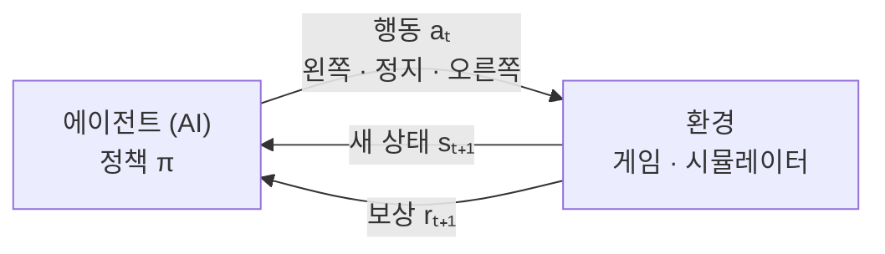
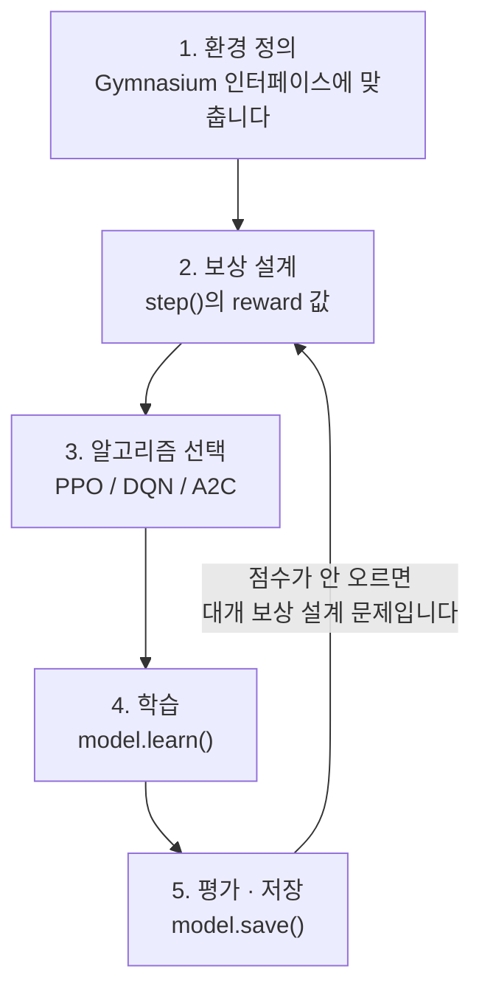

# 강화학습이란 무엇인가 — 보상 하나로 배우는 구조

```
읽는 대상   로봇·시뮬레이션은 다뤄봤고 ACT 같은 모방학습도 굴려봤지만,
            강화학습은 용어부터 막히는 상태
다 읽으면   왜 강화학습이라는 방식이 따로 생겼는지, 보상과 가치가 어떻게 다른지,
            탐험 비율을 왜 조절하는지, 내가 하던 작업 어디에 걸리는지
필요 지식   없습니다. MDP·PPO를 몰라도 읽히도록 썼습니다
분량        약 15분
```

---

## 1. 문제 장면 — 정답지가 없습니다

고양이 사진을 분류하는 일은 방법이 분명합니다. 사진 10만 장에 "고양이/개"라는 **정답을 붙여** 놓고, 틀리면 고치라고 시키면 됩니다.

그런데 **자전거 타는 법**을 같은 방식으로 가르쳐 보십시오. 막힙니다.

- "이 순간 핸들을 정확히 몇 도 꺾는 게 정답인가?" — 아무도 모릅니다
- 정답을 안다 해도 자세마다 다릅니다. 자세는 무한합니다
- 넘어지고 나서야 "아까 그게 틀렸구나"를 압니다. **틀린 시점과 넘어진 시점이 다릅니다**

로봇도 똑같습니다. 장애물을 피하는 자동차에게 "이 상태에서는 왼쪽이 정답"이라고 일일이 적어 줄 수가 없습니다. 적어 줄 수 있으면 이미 그 문제를 푼 것이고, AI가 필요 없습니다.

> **핵심 질문** — 정답을 못 알려 주는데, 어떻게 잘하는 쪽으로 몰아갈 수 있습니까?

강화학습은 여기에 답을 하나 내놓습니다. **정답 대신 점수를 줍니다.** 충돌하면 −100점, 살아 있으면 +1점. 정답은 없고 점수만 있습니다. 나머지는 스스로 찾게 둡니다.

---

## 2. 그래서 무엇이 필요한가

점수만으로 학습이 굴러가려면 부품이 다섯 개 필요합니다. 각각 없으면 무엇이 깨지는지가 분명합니다.

| # | 부품 | 무엇인가 | 없으면 |
|---|---|---|---|
| 1 | **환경(Environment)** | 행동을 받아 결과를 돌려주는 세계 | 시도할 곳이 없습니다. 학습 자체가 시작되지 않습니다 |
| 2 | **상태(State)** | 지금 무엇이 보이는가 | 무엇을 보고 판단할지가 없습니다. 매번 같은 행동만 합니다 |
| 3 | **행동(Action)** | 취할 수 있는 선택지 | 개입할 수단이 없습니다. 관찰만 하게 됩니다 |
| 4 | **보상(Reward)** | 그 행동이 좋았는지 나타내는 점수 | **잘함과 못함의 구별이 사라집니다.** 학습 방향이 없습니다 |
| 5 | **정책(Policy)** | 상태를 받아 행동을 내는 규칙 | 배운 것을 담아 둘 그릇이 없습니다 |

**4번이 이 방식의 심장입니다.** 정답 대신 쓰는 것이라서, 보상 설계가 곧 문제 정의입니다. 보상을 잘못 주면 AI는 우리가 시킨 대로가 아니라 **점수가 잘 나오는 대로** 움직입니다.

### 다른 학습 방식과 어디가 다른가

| 학습 방법 | 데이터 | 학습 목표 | 예시 |
|---|---|---|---|
| **지도학습** | 정답이 붙은 데이터 | 정답 맞히기 | 고양이 사진 분류 |
| **비지도학습** | 정답 없는 데이터 | 패턴 찾기 | 고객 그룹화 |
| **강화학습** | 상호작용으로 직접 모은 데이터 | 누적 보상 최대화 | 게임 승리, 자율주행 |

표만 보면 셋이 나란한 형제처럼 보이는데, 실제 관계는 나란하지 않습니다. 그림으로 보면 자리가 분명해집니다.

<figure>
<svg viewBox="0 0 720 400" role="img" aria-label="머신러닝 안에서 지도학습과 강화학습이 겹치는 자리에 모방학습이 있고, 비지도학습은 따로 떨어져 있는 벤다이어그램" style="width:100%;height:auto" font-family="Malgun Gothic, sans-serif">
  <rect x="8" y="8" width="704" height="376" rx="18" fill="none" stroke="currentColor" stroke-opacity="0.35" stroke-dasharray="6 6"/>
  <text x="28" y="38" font-size="14" fill="currentColor" fill-opacity="0.7">머신러닝</text>

  <circle cx="250" cy="220" r="118" fill="currentColor" fill-opacity="0.06" stroke="currentColor" stroke-opacity="0.55"/>
  <circle cx="420" cy="220" r="118" fill="currentColor" fill-opacity="0.06" stroke="currentColor" stroke-opacity="0.55"/>
  <circle cx="622" cy="200" r="72"  fill="currentColor" fill-opacity="0.06" stroke="currentColor" stroke-opacity="0.55"/>

  <path d="M335,138.15 A118,118 0 0,1 335,301.85 A118,118 0 0,1 335,138.15Z" fill="#0E9AA8" fill-opacity="0.18"/>

  <text x="217" y="200" font-size="15" text-anchor="middle" fill="currentColor">지도학습</text>
  <text x="217" y="222" font-size="11" text-anchor="middle" fill="currentColor" fill-opacity="0.7">정답을 맞힙니다</text>

  <text x="453" y="200" font-size="15" text-anchor="middle" fill="currentColor">강화학습</text>
  <text x="453" y="222" font-size="11" text-anchor="middle" fill="currentColor" fill-opacity="0.7">보상을 최대로 만듭니다</text>

  <text x="622" y="196" font-size="14" text-anchor="middle" fill="currentColor">비지도학습</text>
  <text x="622" y="218" font-size="11" text-anchor="middle" fill="currentColor" fill-opacity="0.7">패턴을 찾습니다</text>

  <text x="335" y="214" font-size="13" font-weight="700" text-anchor="middle" fill="#0E9AA8">모방</text>
  <text x="335" y="231" font-size="13" font-weight="700" text-anchor="middle" fill="#0E9AA8">학습</text>

  <line x1="335" y1="303" x2="335" y2="344" stroke="#0E9AA8" stroke-width="1.5"/>
  <text x="335" y="364" font-size="12" text-anchor="middle" fill="#0E9AA8">시범(정답)도 있고 보상 구조도 있는 자리 — ACT가 여기입니다</text>
</svg>
<figcaption><strong>그림 1.</strong> 모방학습은 강화학습의 반대편이 아니라 <strong>지도학습과 강화학습이 겹치는 자리</strong>입니다. 문제는 강화학습의 문제(상태→행동→보상)인데, 푸는 방법은 시범을 정답 삼는 지도학습입니다.</figcaption>
</figure>

이 그림이 이 문서를 읽는 이유이기도 합니다. ACT로 하던 일이 강화학습과 무관한 게 아니라, **보상 대신 시범을 쓴 특수한 경우**였습니다.

---

## 3. 이 순환에 이름이 붙어 있습니다 — MDP

앞의 다섯 부품이 도는 방식에는 공식 이름이 있습니다. **MDP(Markov Decision Process, 마르코프 결정 과정)** 입니다. 어렵게 들리지만 하는 말은 한 문장입니다.

> 지금 상태를 보고 → 행동을 하나 고르고 → 새 상태와 보상을 받고 → 다시 처음으로.



<p align="center"><sub><strong>그림 2.</strong> 한 바퀴가 한 스텝입니다. 학습에 필요한 정보는 전부 이 화살표 세 개 위에만 실려 다닙니다.</sub></p>

자동차 회피 게임으로 옮기면 이렇게 됩니다.

```python
# 상태(State): 현재 차량과 장애물의 위치
state = [car_x, obstacle_x, obstacle_y]

# 행동(Action): 0=왼쪽, 1=정지, 2=오른쪽
action = 0  # 왼쪽으로 이동

# 보상(Reward): 행동의 결과에 대한 점수
if collision:
    reward = -100  # 충돌하면 큰 벌점
else:
    reward = +1    # 생존하면 작은 보상
```

**"마르코프"가 붙은 이유** — 다음 상태를 정하는 데 **지금 상태만** 쓰고 과거 기록은 안 쓴다는 가정입니다. 체스판을 보면 어떻게 여기까지 왔는지 몰라도 다음 수를 둘 수 있는 것과 같습니다. 이 가정 덕분에 AI가 전체 역사를 기억할 필요가 없어집니다.

---

## 4. 제일 헷갈리는 지점 — 보상과 가치는 다릅니다

강화학습의 목표는 **지금 받는 보상**이 아니라 **끝까지 합친 보상**입니다. 여기서 개념이 하나 더 생깁니다.

- **보상 함수(Reward)** — "방금 그 행동, 몇 점?"
- **가치 함수(Value)** — "이 상태에 있으면 **앞으로** 총 몇 점 벌까?"

<figure>
<svg viewBox="0 0 720 270" role="img" aria-label="시간축 위에 다섯 스텝의 보상 상자가 놓여 있고, 보상 함수는 첫 칸만, 가치 함수는 전체를 할인해 더한다는 것을 괄호로 표시한 그림" style="width:100%;height:auto" font-family="Malgun Gothic, sans-serif">
  <text x="60" y="70" font-size="13" font-weight="700" fill="#0E9AA8">보상 함수 — 지금 이 한 칸만 평가합니다</text>
  <path d="M60,96 L60,86 L136,86 L136,96" fill="none" stroke="#0E9AA8" stroke-width="1.5"/>

  <g fill="currentColor" fill-opacity="0.05" stroke="currentColor" stroke-opacity="0.5">
    <rect x="60"  y="110" width="76" height="48" rx="6"/>
    <rect x="172" y="110" width="76" height="48" rx="6"/>
    <rect x="396" y="110" width="76" height="48" rx="6"/>
    <rect x="508" y="110" width="76" height="48" rx="6"/>
  </g>
  <rect x="284" y="110" width="76" height="48" rx="6" fill="#0E9AA8" fill-opacity="0.15" stroke="#0E9AA8" stroke-width="1.5"/>

  <g font-size="10" fill="currentColor" fill-opacity="0.6">
    <text x="68" y="126">t</text><text x="180" y="126">t+1</text><text x="292" y="126">t+2</text>
    <text x="404" y="126">t+3</text><text x="516" y="126">t+4</text>
  </g>
  <g font-size="14" text-anchor="middle" fill="currentColor">
    <text x="98" y="148">+0.1</text><text x="210" y="148">+0.1</text>
    <text x="322" y="148" fill="#0E9AA8" font-weight="700">+70</text>
    <text x="434" y="148">+0.1</text><text x="546" y="148">+0.1</text>
  </g>
  <text x="322" y="100" font-size="10" text-anchor="middle" fill="#0E9AA8">장애물 회피 성공</text>

  <g font-size="11" text-anchor="middle" fill="currentColor" fill-opacity="0.7">
    <text x="98" y="178">×1</text><text x="210" y="178">×0.99</text><text x="322" y="178">×0.99²</text>
    <text x="434" y="178">×0.99³</text><text x="546" y="178">×0.99⁴</text>
  </g>

  <path d="M60,196 L60,206 L584,206 L584,196" fill="none" stroke="currentColor" stroke-width="1.5"/>
  <text x="60" y="226" font-size="13" font-weight="700" fill="currentColor">가치 함수 — 앞으로 받을 보상 전부를 할인해서 더합니다</text>
  <text x="60" y="250" font-size="12" fill="currentColor" fill-opacity="0.75">V(sₜ) = 0.1 + 0.99×0.1 + 0.99²×70 + 0.99³×0.1 + … ≈ 69.5</text>
</svg>
<figcaption><strong>그림 3.</strong> 같은 시점을 보상은 <strong>0.1점</strong>으로, 가치는 <strong>69.5점</strong>으로 매깁니다. 두 칸 뒤의 +70이 지금 상태의 가치를 끌어올리기 때문입니다. (원문의 예시 수치입니다)</figcaption>
</figure>

### 도표로 정리

| 구분 | 보상 함수(Reward) | 가치 함수(Value) |
|---|---|---|
| 의미 | 즉각적인 점수 | 미래 누적 점수의 예측 |
| 시간 | 지금 당장 | 앞으로 계속 |
| 누가 정하나 | **환경 설계자(우리)** | **AI가 학습** |
| 예시 | "충돌하면 −100점" | "이 위치는 나중에 좋을 것 같다" |
| 코드에서 | `step()`의 `return reward` | PPO 내부 `value_network` |

> ### 비유
>
> 두 회사에서 입사 제안을 받았습니다.
>
> - **A사** 초봉 5,000만 원, 승진은 어렵습니다
> - **B사** 초봉 3,000만 원, 승진이 빠릅니다
>
> **보상**만 보면 A가 5,000, B가 3,000이라 A의 압승입니다.
> **가치**로 10년을 합치면 A는 약 3억, B는 약 5억이 됩니다. B가 이깁니다.
>
> 보상은 첫 달 월급이고, 가치는 10년 치 예상 총액입니다. 강화학습이 고르려는 것은 **총액**입니다.

원래 용어로 돌아오면 이렇습니다. 우리가 코드에 적는 것은 **보상**뿐이고, 가치는 AI가 그 보상들을 겪으면서 스스로 만들어 냅니다.

```python
# ===== 보상 함수: 우리가 직접 설계 =====
def step(self, action):
    reward = 0.1              # 생존 보상
    if collision:
        reward = -100         # 충돌 페널티
    if avoided:
        reward = 70           # 회피 성공 보상
    return obs, reward, done, {}   # 즉시 반환

# ===== 가치 함수: AI가 학습하며 자동으로 생성 =====
class PPO:
    def __init__(self):
        self.value_network = NeuralNetwork()   # 내부에 자동 생성

    def learn(self):
        predicted = self.predict_value(state)
        actual = sum(all_future_rewards)
        error = actual - predicted   # "69점이라 봤는데 실제 80점이었네"
        # → 다음엔 더 정확하게 예측하도록 학습
```

**우리가 할 일은 보상 설계뿐입니다.** "충돌하면 −100"이라고 적어 두면, "충돌 직전 상태는 가치가 낮다"는 것은 AI가 알아서 배웁니다.

### 할인 인자 γ 읽는 법

`0.99`라는 숫자는 취향이 아니라 **AI가 몇 스텝 앞을 보는지**를 정하는 값입니다.

<figure>
<svg viewBox="0 0 720 280" role="img" aria-label="감마 0.99와 0.9의 할인 가중치 감쇠 곡선 비교. 0.99는 100스텝 뒤에도 0.37이 남고 0.9는 20스텝에서 0.12로 떨어진다" style="width:100%;height:auto" font-family="Malgun Gothic, sans-serif">
  <text x="34" y="26" font-size="11" fill="currentColor" fill-opacity="0.7">가중치 γⁿ</text>
  <line x1="90" y1="30" x2="90" y2="220" stroke="currentColor" stroke-opacity="0.5"/>
  <line x1="90" y1="220" x2="672" y2="220" stroke="currentColor" stroke-opacity="0.5"/>
  <g font-size="10" fill="currentColor" fill-opacity="0.6" text-anchor="end">
    <text x="82" y="44">1.0</text><text x="82" y="134">0.5</text><text x="82" y="224">0</text>
  </g>
  <g stroke="currentColor" stroke-opacity="0.15">
    <line x1="90" y1="40" x2="672" y2="40"/><line x1="90" y1="130" x2="672" y2="130"/>
  </g>
  <g font-size="10" fill="currentColor" fill-opacity="0.6" text-anchor="middle">
    <text x="90" y="238">0</text><text x="204" y="238">20</text><text x="318" y="238">40</text>
    <text x="432" y="238">60</text><text x="546" y="238">80</text><text x="660" y="238">100</text>
  </g>
  <text x="381" y="262" font-size="11" text-anchor="middle" fill="currentColor" fill-opacity="0.7">몇 스텝 뒤의 보상인가</text>

  <polyline points="90,40 147,57 204,73 318,100 432,122 546,139 660,154" fill="none" stroke="#0E9AA8" stroke-width="2.5"/>
  <polyline points="90,40 118,114 147,157 204,198 318,217 432,220 660,220" fill="none" stroke="currentColor" stroke-opacity="0.75" stroke-width="2" stroke-dasharray="5 4"/>

  <line x1="470" y1="58" x2="500" y2="58" stroke="#0E9AA8" stroke-width="2.5"/>
  <text x="508" y="62" font-size="12" fill="#0E9AA8">γ = 0.99 — 멀리 봅니다</text>
  <line x1="470" y1="82" x2="500" y2="82" stroke="currentColor" stroke-opacity="0.75" stroke-width="2" stroke-dasharray="5 4"/>
  <text x="508" y="86" font-size="12" fill="currentColor" fill-opacity="0.8">γ = 0.9 — 코앞만 봅니다</text>
</svg>
<figcaption><strong>그림 4.</strong> γ=0.99면 100스텝 뒤 보상도 37%가 반영되지만, γ=0.9면 20스텝 만에 12%로 꺼집니다. <strong>γ는 시야 거리입니다.</strong> (γⁿ을 그대로 계산한 값입니다)</figcaption>
</figure>

체스에서 말을 희생하는 수는 γ가 작으면 절대 안 나옵니다. 손해는 지금이고 이득은 20수 뒤인데, 20수 뒤가 안 보이기 때문입니다.

---

## 5. 어떻게 '최적'을 찾아가는가 — 탐험과 활용

정답이 없으니 AI는 직접 해 보면서 알아내야 합니다. 그런데 매 순간 선택이 갈립니다.

- **활용(Exploitation)** — 아는 것 중 제일 좋은 것을 씁니다
- **탐험(Exploration)** — 안 해 본 것을 시도해 봅니다

> ### 비유
>
> 매주 금요일에 피자를 시킵니다.
>
> - **A집** 10번 먹었고 평균 8점 — 확실히 맛있습니다
> - **B집** 새로 생겼고 아직 안 먹어봤습니다 — 몇 점인지 모릅니다
>
> 계속 A만 시키면 **평생 B가 10점짜리라는 걸 모르고 삽니다.**
> 매번 새 집만 뚫으면 **맛있는 걸 알고도 못 먹습니다.**
>
> 답은 "둘 중 하나"가 아니라 **비율**입니다.

한쪽으로 치우치면 이렇게 됩니다.

| 치우침 | 결과 |
|---|---|
| 탐험만 | 배운 것을 써먹지 못합니다. 점수가 안 오릅니다 |
| 활용만 | 처음 찾은 방법에 갇힙니다 — **국소 최적(Local Optimum)** |

국소 최적은 산 등반과 같습니다. "지금 자리가 제일 높으니 여기가 정상"이라고 결론 내렸는데, 실제로는 작은 언덕이었던 상황입니다. 다른 방향을 안 가 봤으면 영원히 모릅니다.

### 그래서 비율을 시간에 따라 바꿉니다

<figure>
<svg viewBox="0 0 720 240" role="img" aria-label="학습 초기 중기 후기의 탐험과 활용 비율을 나타낸 누적 막대그래프. 초기 90대 10에서 후기 5대 95로 바뀐다" style="width:100%;height:auto" font-family="Malgun Gothic, sans-serif">
  <rect x="160" y="18" width="12" height="12" fill="#0E9AA8"/>
  <text x="178" y="29" font-size="12" fill="currentColor">탐험</text>
  <rect x="240" y="18" width="12" height="12" fill="currentColor" fill-opacity="0.12" stroke="currentColor" stroke-opacity="0.4"/>
  <text x="258" y="29" font-size="12" fill="currentColor">활용</text>

  <g font-size="12" fill="currentColor">
    <text x="10" y="80">초기 — 1~1000 에피소드</text>
    <text x="10" y="130">중기 — 1000~5000</text>
    <text x="10" y="180">후기 — 5000 이후</text>
  </g>

  <g>
    <rect x="210" y="60"  width="396" height="32" fill="#0E9AA8"/>
    <rect x="606" y="60"  width="44"  height="32" fill="currentColor" fill-opacity="0.12" stroke="currentColor" stroke-opacity="0.4"/>
    <rect x="210" y="110" width="132" height="32" fill="#0E9AA8"/>
    <rect x="342" y="110" width="308" height="32" fill="currentColor" fill-opacity="0.12" stroke="currentColor" stroke-opacity="0.4"/>
    <rect x="210" y="160" width="22"  height="32" fill="#0E9AA8"/>
    <rect x="232" y="160" width="418" height="32" fill="currentColor" fill-opacity="0.12" stroke="currentColor" stroke-opacity="0.4"/>
  </g>

  <g font-size="11" text-anchor="middle">
    <text x="408" y="80" fill="#ffffff">탐험 90%</text>
    <text x="628" y="80" fill="currentColor">10%</text>
    <text x="276" y="130" fill="#ffffff">30%</text>
    <text x="496" y="130" fill="currentColor">활용 70%</text>
    <text x="441" y="180" fill="currentColor">활용 95%</text>
  </g>
  <text x="238" y="180" font-size="11" fill="currentColor">← 탐험 5%</text>

  <line x1="210" y1="206" x2="650" y2="206" stroke="currentColor" stroke-opacity="0.4"/>
  <g font-size="10" fill="currentColor" fill-opacity="0.6" text-anchor="middle">
    <text x="210" y="222">0%</text><text x="430" y="222">50%</text><text x="650" y="222">100%</text>
  </g>
</svg>
<figcaption><strong>그림 5.</strong> 처음엔 세상을 훑고, 나중엔 아는 것을 씁니다. <strong>후기에도 5%는 남겨 둡니다</strong> — 더 좋은 방법이 남아 있을 가능성을 버리지 않기 위해서입니다. (원문이 든 예시 스케줄입니다. 측정값이 아닙니다)</figcaption>
</figure>

코드에서는 두 가지 방식으로 조절합니다.

```python
# 방법 1: Entropy Coefficient (PPO)
model = PPO("MlpPolicy", env, ent_coef=0.1)    # 무작위성 크게 → 모험 많이
model = PPO("MlpPolicy", env, ent_coef=0.01)   # 무작위성 작게 → 거의 최적 행동만

# 방법 2: Epsilon-Greedy (DQN)
def choose_action(state, epsilon=0.1):
    if random.random() < epsilon:
        return random_action()      # 탐험
    else:
        return best_action(state)   # 활용
```

| 구분 | 탐험(Exploration) | 활용(Exploitation) |
|---|---|---|
| 목적 | 새로운 지식 획득 | 아는 지식 사용 |
| 위험도 | 높습니다 (실패 가능) | 낮습니다 (검증됨) |
| 언제 | 학습 초기 | 학습 후기 |
| 비유 | 신메뉴 도전 | 단골 메뉴 주문 |
| 결과 | 정보 수집 | 점수 최대화 |

**얼마나 탐험할지는 환경이 정합니다.** 3×3 미로면 10%로 충분하고, 바둑이나 스타크래프트처럼 경우의 수가 사실상 무한하면 30~50%가 필요합니다.

---

## 6. 이미 해 본 것과 연결하기 ★

이 문서에서 제일 중요한 절입니다. 새 개념을 외우는 게 아니라, **이미 겪은 일에 이름이 붙는 것**으로 보면 훨씬 빨리 붙습니다.

| 이 프로젝트에서 겪은 것 | 강화학습 용어 |
|---|---|
| Isaac Sim 씬에서 로봇·큐브·박스가 물리로 움직이는 것 | **환경(Environment)** |
| 카메라 2장 + 관절값 6개를 매 스텝 기록한 것 | **상태(State) / 관측(Observation)** |
| 상태기계가 내보낸 목표 자세 → IK로 푼 관절 명령 | **행동(Action)** |
| 상태기계가 큐브 참값을 보고 시범을 만든 것 | **전문가 정책(Expert Policy)** |
| ACT가 그 시범을 흉내 내도록 학습한 것 | **모방학습 / 행동복제** — 그림 1의 겹친 부분 |
| 조명·카메라를 흔들어 조건을 바꾼 것 | **도메인 무작위화** — 강화학습에서도 그대로 씁니다 |
| 에피소드가 끝나고 씬을 리셋한 것 | **`env.reset()`** |

**차이는 딱 하나입니다.** ACT에게는 "이 순간 정답 행동은 이것"이라고 알려 주었습니다. 강화학습에게는 안 알려 주고 **점수만** 줍니다. 나머지 구조는 거의 그대로입니다.

그래서 이런 대응이 성립합니다.

| ACT(모방학습) 쪽 | 강화학습 쪽 |
|---|---|
| 시범 데이터셋을 미리 모읍니다 | 학습하면서 스스로 만듭니다 |
| 시범보다 잘하기는 어렵습니다 | **시범을 넘어설 수 있습니다** |
| 보상 설계가 필요 없습니다 | **보상 설계가 제일 어렵습니다** |
| 데이터 모으는 비용이 큽니다 | 시뮬 스텝 수가 많이 듭니다 |

---

## 7. 실제로 돌리는 절차

도구는 사실상 두 개로 정리됩니다. **Gymnasium**(환경 규격)과 **Stable Baselines3**(알고리즘 모음)입니다.



<p align="center"><sub><strong>그림 6.</strong> 되돌아오는 화살표가 실제 작업량의 대부분입니다. 알고리즘을 바꾸기 전에 보상부터 다시 봅니다.</sub></p>

### 1단계 — 환경을 표준 규격에 맞춥니다

모든 게임에 "시작 버튼, 조작 버튼, 점수 표시"가 있는 것처럼, Gymnasium은 환경이 지켜야 할 인터페이스를 정해 둡니다.

```python
import gymnasium as gym

env = gym.make("CartPole-v1")          # 또는 직접 만든 CarRacingEnv()

observation, info = env.reset()        # 게임 시작
for step in range(1000):
    action = env.action_space.sample() # 무작위 행동
    observation, reward, terminated, truncated, info = env.step(action)
    if terminated or truncated:
        observation, info = env.reset()
env.close()
```

**규격이 있으면 환경과 알고리즘이 분리됩니다.** 같은 알고리즘으로 다른 게임을 돌릴 수 있고, 같은 게임을 여러 알고리즘으로 비교할 수 있습니다.

### 2단계 — 보상을 설계합니다

여기가 실제로 제일 오래 걸립니다. AI는 우리 의도가 아니라 점수를 따라가기 때문입니다.

### 3단계 — 알고리즘을 고릅니다

| 알고리즘 | 특징 | 적합한 상황 |
|---|---|---|
| **PPO** | 안정적, 범용적 | 대부분의 상황 — **먼저 이걸 씁니다** |
| **DQN** | 이산 행동에 특화 | 게임, 로봇 제어 |
| **A2C** | 빠른 학습 | 간단한 환경 |

PPO의 아이디어는 이름에 들어 있습니다. Proximal = 가까운. **정책을 한 번에 확 바꾸지 않고 조금씩만 바꿉니다.** 급하게 바꾸면 학습이 무너지기 때문입니다.

### 4~5단계 — 학습하고 저장합니다

```python
from stable_baselines3 import PPO

model = PPO(
    "MlpPolicy",           # 신경망 정책
    env,                   # 환경
    learning_rate=0.0003,  # 학습 속도 (크면 불안정)
    n_steps=2048,          # 한 번에 모을 경험의 양
    batch_size=64,         # 한 번에 학습할 데이터 크기
    n_epochs=10,           # 같은 데이터를 반복 학습할 횟수
    ent_coef=0.01,         # 탐험 장려 정도
)

model.learn(total_timesteps=10000)
model.save("my_ai")
model = PPO.load("my_ai")
```

`value_loss`가 로그에 찍히면 **가치 함수가 학습되고 있다는 증거**입니다. 직접 들여다볼 수는 없지만 살아 있는지는 이 값으로 압니다.

---

## 8. 헷갈리기 쉬운 것 세 가지

**① 보상 함수를 만들었으면 가치 함수도 만들어야 하나?**
아닙니다. **보상만 설계하면 됩니다.** 가치 함수는 PPO 안에서 자동으로 생기고 자동으로 학습됩니다.

**② 점수가 안 오르면 알고리즘을 바꿔야 하나?**
대개 아닙니다. **보상 설계를 먼저 의심합니다.** AI가 이상하게 움직이면 십중팔구 그 행동이 실제로 점수를 잘 받고 있습니다. 우리가 의도한 것과 우리가 적어 준 것이 달랐던 겁니다.

**③ 탐험은 학습 후기에 0으로 만들면 되나?**
아닙니다. 5% 정도는 남겨 둡니다. 1,000판을 돌고 "오른쪽이 최선"이라고 결론 냈어도, 1,001판째에 "중앙 유지"가 더 좋다는 것이 나올 수 있습니다. 0으로 만드는 순간 그 가능성이 닫힙니다.

---

## 9. 한 장 요약

| 개념 | 한 줄 |
|---|---|
| **강화학습** | 정답 대신 점수를 주고, 시행착오로 스스로 찾게 하는 방식입니다 |
| **MDP** | 상태 → 행동 → 보상 → 새 상태로 도는 순환 구조입니다 |
| **보상 함수** | 지금 이 행동의 점수. **우리가 코드에 적습니다** |
| **가치 함수** | 이 상태의 미래 총점 예측. **AI가 스스로 만듭니다** |
| **할인 인자 γ** | 몇 스텝 앞까지 보는지 정하는 시야 거리입니다 |
| **탐험 / 활용** | 새 길과 아는 길의 비율. 초기엔 탐험, 후기엔 활용입니다 |
| **Gymnasium** | 환경이 지켜야 할 표준 인터페이스입니다 |
| **PPO** | 정책을 조금씩만 바꾸는 안정적인 알고리즘. 먼저 이걸 씁니다 |

**관통하는 원칙 하나** — 우리가 정의하는 것은 **환경과 보상**뿐입니다. 정책도 가치도 AI가 만듭니다. 그래서 강화학습에서 잘못되는 일의 대부분은 알고리즘이 아니라 **보상 설계**에서 나옵니다.

**이 프로젝트와의 접점** — ACT는 그림 1의 겹친 자리에 있습니다. 시범을 정답으로 쓰기 때문에 보상 설계가 필요 없었습니다. 시범을 넘어서는 성능이 필요해지는 순간, 그때 보상 설계가 과제로 올라옵니다.

**다음에 읽을 것** — 원문 2장의 2D 자동차 예제를 직접 돌려 보면서 `ent_coef`만 바꿔 학습 곡선을 비교해 보는 것이 체감이 빠릅니다.

---

## 10. 출처

**원문**

- 위키독스, 『로보틱스를 위한 강화학습 이미테이션러닝 입문』 — [1. 강화학습이란?](https://wikidocs.net/325539)
  원문 마지막 편집 2026-02-05 / **조회일 2026-08-16**
- 이 문서는 위 페이지의 1장 전체와, 같은 페이지에 이어 실린 2장(Gymnasium · Stable Baselines3 · PPO) 내용을 설명형으로 다시 구성한 것입니다

**원문에서 그대로 가져온 것**

| 항목 | 비고 |
|---|---|
| 코드 예시 (`step()`, `choose_action()`, PPO 파라미터) | 원문 코드 |
| 학습 방법 3분류 표, 보상/가치 비교표, 탐험/활용 비교표 | 원문 표 |
| 회사 선택 비유, 피자집 비유, 산 등반 비유 | 원문 비유 |
| 그림 3의 수치 (0.1 / 70 / 69.5) | 원문 예시값 |
| 그림 5의 탐험 비율 (90/30/5%) | 원문이 든 **예시 스케줄** |

**이 문서에서 새로 만든 것**

| 항목 | 근거 |
|---|---|
| 그림 1 (벤다이어그램) | 모방학습을 지도학습 ∩ 강화학습에 배치한 것은 통상적 분류에 따른 정리입니다 |
| 그림 4 (γ 감쇠 곡선) | γⁿ을 직접 계산한 값입니다. 실험 결과가 아닙니다 |
| 6장 "이미 해 본 것과 연결" 표 | 이 저장소의 [설명_ACT학습데이터_시뮬생성_5단계.md](설명_ACT학습데이터_시뮬생성_5단계.md) 내용과 대응시킨 것입니다 |

**주의**

- 그림 3·5의 숫자는 **개념 설명용 예시값**이며 실측이나 시뮬 결과가 아닙니다
- 원문의 학습 곡선 수치(평균 점수 10 → 50 → 90점)는 재현하지 않았습니다. 측정 조건이 명시돼 있지 않아 그리지 않았습니다

비유는 이해를 돕는 장치이므로 정확한 조건은 원문을 확인하시기 바랍니다.

**원문과 다르면 원문이 맞습니다.**

---

*작성 규칙: [문서작성_가이드.md](문서작성_가이드.md) · 작성일 2026-08-16*
