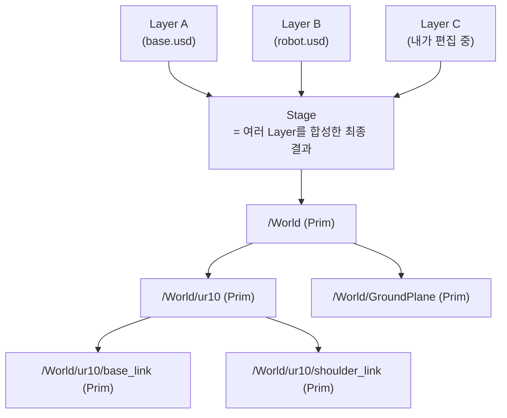
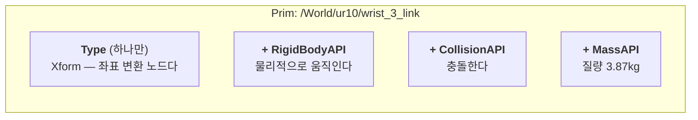
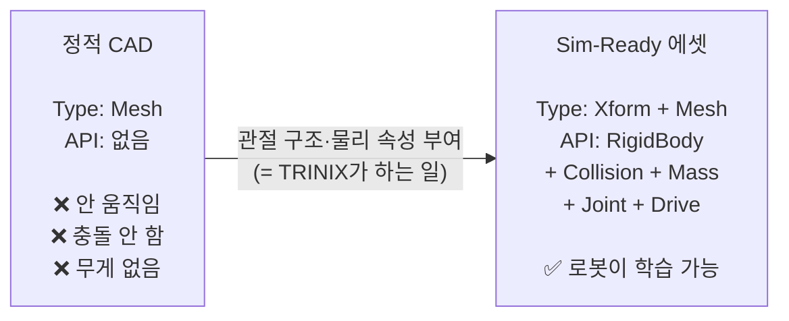
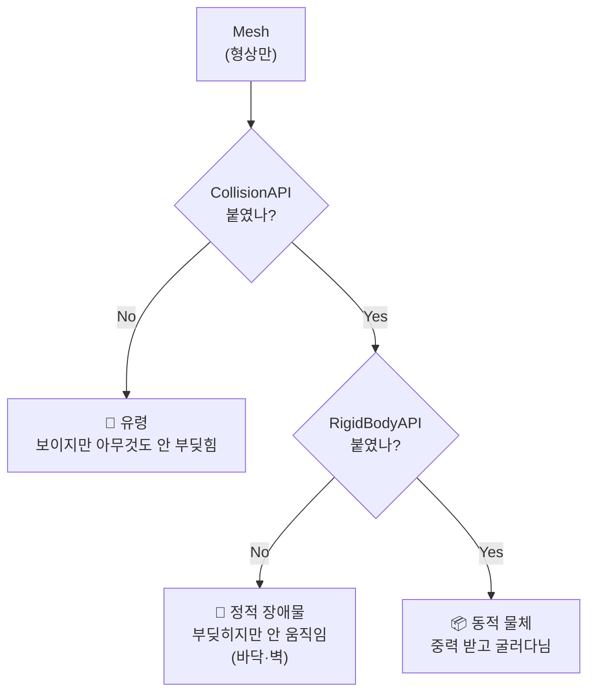
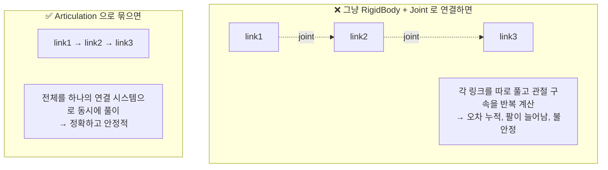
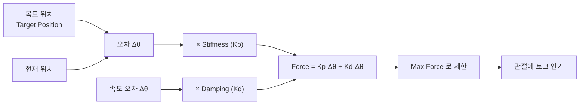
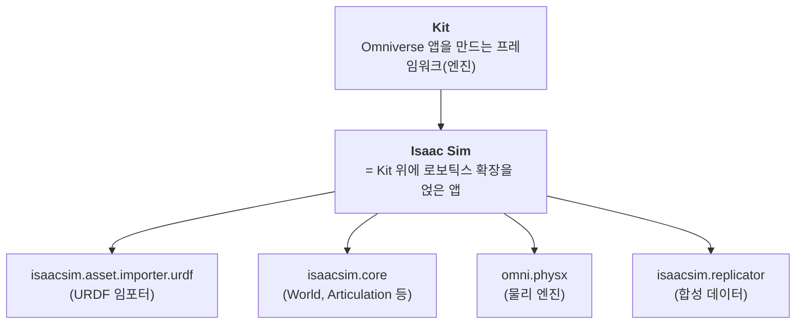

# Isaac Sim 핵심 개념 정리 — 문서가 안 알려주는 것들

> **왜 Isaac Sim 문서가 어려운가**
> 한 문장 안에 **세 가지 출신의 용어**가 섞여 있는데, 아무도 그 경계를 설명해주지 않는다.
>
> | 출신 | 용어 예시 | 정체 |
> |---|---|---|
> | **USD** (Pixar) | Prim, Stage, Schema, Xform, Layer | 씬을 **기술하는 데이터 포맷** |
> | **PhysX** (NVIDIA) | RigidBody, Articulation, Solver, Collider | 물리를 **계산하는 엔진** |
> | **Kit** (Omniverse) | Extension, App, Experience, Fabric | 애플리케이션 **프레임워크** |
>
> 이 세 축을 분리해서 보면 갑자기 읽힌다. 이 문서가 그 분리를 해준다.

---

# PART 1. USD — 씬을 기술하는 언어

## 1-1. Stage / Prim / Layer



| 용어 | 오해하기 쉬운 것 | 실제 |
|---|---|---|
| **Prim** | "primitive니까 큐브·구 같은 도형?" | ❌ **아니다.** 씬 트리의 **노드 하나**를 뜻한다. 폴더일 수도, 로봇일 수도, 카메라일 수도 있다 |
| **Stage** | "무대? 화면?" | 여러 Layer를 **합성한 결과물 전체**. 지금 보고 있는 씬 |
| **Layer** | "포토샵 레이어?" | 비슷하다. `.usd` 파일 하나 = Layer 하나. 위 Layer가 아래를 덮어쓴다 |
| **Path** | | 프림의 주소. `/World/ur10/base_link` — 파일 경로처럼 생겼지만 **씬 내부 주소**다 |

> **MotoSim에 비유하면** — Stage = 셀 전체, Prim = 트리에 보이는 각 항목(로봇·툴·지그),
> Layer = 여러 사람이 각자 만든 파일을 겹쳐서 하나의 셀로 보는 것.

## 1-2. Schema와 API — 여기가 제일 헷갈린다

USD 문서에 **Schema**, **Applied API**, **Typed Schema** 가 나오는데 설명이 불친절하다.

**핵심 한 줄: 프림은 "무엇인가(type)"와 "무엇을 할 수 있는가(API)"를 따로 갖는다.**



| 구분 | 개수 | 의미 | 예시 |
|---|---|---|---|
| **Typed Schema** (type) | **하나** | 이 프림이 **무엇인가** | `Xform`, `Mesh`, `Camera`, `Scope` |
| **Applied API Schema** | **여러 개** | 이 프림이 **무슨 능력을 갖는가** | `RigidBodyAPI`, `CollisionAPI`, `MassAPI`, `DriveAPI` |

**비유** — Type은 "이것은 자동차다", API는 "여기에 에어컨·썬루프·네비를 옵션으로 달았다".

### 왜 이 구조가 중요한가 — 엔닷라이트의 사업이 바로 이것이다



기사의 *"컨베이어벨트는 돌지 않고, 폴딩폰은 접히지 않는다"* 가 정확히
**왼쪽 상태**를 말한 것이다. Mesh는 있는데 API가 없다.

### 코드에서 보면
```python
from pxr import UsdPhysics

# "이 프림에 질량 능력을 붙인다"
mass_api = UsdPhysics.MassAPI.Apply(prim)   # ← Apply 가 API를 붙이는 동작
mass_api.GetMassAttr().Set(5.0)             # ← 붙인 뒤에야 속성 접근 가능
```
> 오늘 payload를 구현할 때 쓴 코드가 이거다. `.Apply()` 를 안 하고
> `GetMassAttr()` 을 부르면 없는 속성이라 실패한다.

## 1-3. Xform — 좌표 변환

`Xform` = **Transform**의 줄임. 위치·회전·스케일을 갖는 노드.

```
/World/ur10           Xform  ← 로봇 전체의 위치
  └ base_link         Xform  ← 베이스의 상대 위치
      └ visual        Mesh   ← 실제 형상
```

**부모의 변환이 자식에 누적된다.** 로봇 전체를 옮기려면 최상위 Xform만 옮기면 된다.

---

# PART 2. 물리 — PhysX가 계산하는 것

## 2-1. 물리 객체가 되려면 뭐가 필요한가



**STEP 1 실습의 예측 문제 답이 여기 있다.**

| API 조합 | 결과 |
|---|---|
| Mesh만 | 보이기만 함. Play해도 그대로 |
| Mesh + Collision | 바닥·벽 역할. 다른 물체가 부딪힘. 자기는 안 움직임 |
| Mesh + Collision + RigidBody | 떨어지고 굴러감 |
| Mesh + RigidBody (**Collision 없음**) | 떨어지는데 **바닥을 통과한다** |

## 2-2. Collider 근사 — 왜 형상 그대로 안 쓰나

PhysX는 **볼록(convex) 형상**에서 훨씬 빠르게 충돌을 계산한다.
오목한 메시는 그대로 못 쓰고 근사하거나 분해해야 한다.

```
원본 (오목한 그리퍼)      Convex Hull            Convex Decomposition
                                                  
    ┌─┐   ┌─┐            ┌─────────┐              ┌─┐   ┌─┐
    │ │   │ │            │         │              │ │   │ │
    │ └───┘ │     →      │         │      또는    │ └─┬─┘ │
    └───────┘            └─────────┘              └───┴───┘
    
  손가락 사이 빈틈       빈틈이 메워짐            조각으로 나눠 형상 유지
  (물건을 잡아야 함)     ❌ 물건을 못 잡음         ✅ 잡을 수 있음 (무겁다)
```

| 방식 | 정확도 | 속도 | 언제 |
|---|---|---|---|
| **Bounding Cube/Sphere** | 최저 | 최고 | 충돌이 대충만 맞으면 되는 링크 |
| **Convex Hull** | 중간 | 빠름 | **기본값.** 대부분의 로봇 링크 |
| **Convex Decomposition** | 높음 | 느림 | 그리퍼 손가락처럼 오목이 중요한 곳 |
| **Triangle Mesh** | 최고 | 최저 | 정적 환경(바닥·벽)에만. 동적 물체엔 못 씀 |

> **면접 포인트** — "Convex Hull이 기본인 이유"를 물으면
> **정확도와 연산량의 트레이드오프**이고, **링크마다 다르게 줄 수 있다**고 답하면 된다.

## 2-3. Physics Scene

씬에 하나 있는 **전역 물리 설정 프림**. 여기서 정하는 것:
- 중력 방향·크기
- 솔버 종류 (TGS / PGS)
- 시간 스텝(dt), 서브스텝 수

> **오늘의 26ms 지연과 연결** — `dt = 1/120초 = 8.33ms` 가 여기서 정해진다.
> STEP 7 과제 3(240Hz 실험)이 이 값을 바꾸는 것이다.

---

# PART 3. 로봇 — Articulation

## 3-1. Articulation이 뭐고 왜 필요한가

**"관절로 연결된 강체들을 하나의 단위로 푸는 것."**



**이게 왜 중요한가** — 6축 로봇을 개별 강체로 만들면 팔이 축 늘어지거나 떨린다.
Articulation으로 묶어야 산업용 로봇처럼 강건하게 동작한다.

## 3-2. ArticulationRootAPI 는 어디에 붙나

**로봇 트리의 최상위 프림**에 붙인다. "여기서부터 아래는 한 덩어리다"라는 선언.

```
/World/ur10                    ← ★ ArticulationRootAPI 여기
  ├ base_link                    (RigidBodyAPI)
  ├ shoulder_link                (RigidBodyAPI)
  ├ shoulder_pan_joint           (RevoluteJoint + DriveAPI)
  ├ upper_arm_link               (RigidBodyAPI)
  ├ shoulder_lift_joint          (RevoluteJoint + DriveAPI)
  └ ...
```

> **STEP 0 자가진단 2번의 답이 이것이다.** 각 링크가 아니라 **최상위**다.

## 3-3. Joint 종류

| USD 타입 | 자유도 | 예시 |
|---|---|---|
| `PhysicsRevoluteJoint` | 회전 1 | 로봇 관절 대부분, 문 경첩 |
| `PhysicsPrismaticJoint` | 직선 1 | 그리퍼 손가락, **서랍**, 리니어 액추에이터 |
| `PhysicsFixedJoint` | 0 | 툴 장착, 베이스 고정 |
| `PhysicsSphericalJoint` | 회전 3 | 볼조인트 |

> **엔닷라이트 맥락** — 서랍 = Prismatic, 문 = Revolute, 컨베이어 = Revolute(무한회전).
> 정적 CAD에 **어떤 Joint를 어디에 어느 축으로** 붙일지 정하는 게 Sim-Ready 변환의 핵심이다.

## 3-4. Drive — 관절의 제어기 ★

**여기가 오늘의 주제였다.**



| 속성 | 역할 | 오해 |
|---|---|---|
| **Stiffness** | Kp. 목표로 **당기는** 힘 | 높을수록 좋은 게 아니다. 수치 불안정 |
| **Damping** | Kd. 속도에 **저항**하는 힘 (브레이크) | URDF의 `<dynamics damping>` 과 **다른 것** |
| **Max Force** | 낼 수 있는 최대 토크 | 여기에 걸리면 게인을 올려도 소용없다 |
| **Target Position** | 목표 각도 | 여기에 명령을 준다 |
| **Drive Type** | Position / Velocity / **None(토크)** | **None이면 stiffness/damping이 0으로 무시된다** |

### ⚠️ 이름이 같아서 헷갈리는 것 — damping 두 개

```
URDF <dynamics damping="0.5"/>          Drive > Damping (Kd)
      ↓                                        ↓
관절 자체의 점성 마찰                     제어기의 D 게인
(베어링·그리스)                           (오버슈트 억제)
로봇 전원 꺼도 존재                       전원 끄면 사라짐
= 하드웨어 물성                           = 제어 설정
```

**면접에서 "URDF에 damping 있는데 왜 또 넣나요"의 답이 이 표다.**

---

# PART 4. 소프트웨어 구조 — Kit / Extension / World

## 4-1. Omniverse 앱 구조



| 용어 | 의미 |
|---|---|
| **Kit** | 앱 프레임워크. Isaac Sim·USD Composer 등이 모두 Kit 위에 있다 |
| **Extension** | 기능 플러그인. `Window > Extensions` 에서 켜고 끈다 |
| **Experience (`.kit` 파일)** | "어떤 Extension들을 켜서 앱을 구성할지" 정의한 레시피 |

> `isaacsim isaacsim.exp.full.kit` 처럼 실행하는 걸 본 적 있다면,
> 저 `.kit` 이 Experience 파일이다.

## 4-2. World vs Stage — 실전에서 제일 헷갈리는 쌍

```
USD Stage                          Isaac Sim World
─────────────────                  ─────────────────
"씬에 뭐가 있나"                    "시뮬레이션을 어떻게 돌리나"
프림 트리, 속성                     물리 스텝, 리셋, 시간 관리
pxr.Usd 계열 API                   isaacsim.core.api 계열 API

omni.usd.get_context()             World(physics_dt=1/120)
   .get_stage()                    world.reset()
                                   world.step()
```

**Stage는 데이터, World는 실행기.** 같은 씬을 다른 관점에서 다루는 것이다.

## 4-3. Articulation 관련 클래스가 두 개인 이유

오늘 에러가 났던 지점이다.

| 클래스 | 대상 | 쓰는 곳 |
|---|---|---|
| `SingleArticulation` | 로봇 **한 대** | 일반 스크립트 |
| `Articulation` (view) | 로봇 **여러 대 동시** | RL 학습 (수천 개 환경 병렬) |

> Isaac Lab에서 수천 개 로봇을 동시에 학습시킬 때 개별 접근하면 느리다.
> 그래서 **텐서로 한 번에 다루는** view 클래스가 따로 있다.
> 오늘 로그에 나온 `physics.tensors simulationView` 경고가 이 계열이다.

### 메서드 이름 함정
```python
art.set_joint_positions(q)   # ← 순간이동 (텔레포트). 물리 무시하고 상태를 덮어씀
art.apply_action(ArticulationAction(joint_positions=q))  # ← 제어 목표 (드라이브에 명령)
```
**둘은 완전히 다르다.** 앞은 치트, 뒤가 제어다.
초기 자세를 잡을 땐 앞을, 실제 제어할 땐 뒤를 쓴다.

---

# PART 5. 오늘 만난 에러·경고 메시지 해독

| 메시지 | 뜻 | 문제인가 |
|---|---|---|
| `link ee_link has no body properties ... merged into wrist_3_link` | 질량 없는 더미 링크를 앞 링크에 합쳤다 | ❌ 정상. URDF에 좌표용 더미 링크가 흔하다 |
| `Creating Asset in an in-memory stage, will not create layered structure` | 파일로 저장 안 하고 메모리에만 만든다 | ❌ 정상. 스크립트에서 임시로 쓸 때 |
| `omni.isaac.version has been deprecated in favor of isaacsim.core.version` | 구 네임스페이스 사용 중 | ⚠️ 동작은 함. 5.0에서 `omni.isaac.*` → `isaacsim.*` 로 대개편됨 |
| `prim '/ur10/root_joint' was deleted while being used by a tensor view class` | 씬을 지웠는데 참조가 남아있다 | ⚠️ 반복 실행 시 정리 순서 문제 |
| `attribute overrideClipRange not found for bucket id 9` | Fabric 내부 경고 | ❌ 무시해도 됨 |

> **`omni.isaac.*` vs `isaacsim.*`** — 인터넷 예제 코드가 안 돌아가는 가장 흔한 이유다.
> 5.0부터 네임스페이스가 바뀌었다. 옛날 블로그 코드는 `omni.isaac.core` 를 쓴다.

---

# PART 6. 빠른 조회표

| 문서에서 본 말 | 한 줄 해석 |
|---|---|
| Prim | 씬 트리의 노드 하나 |
| Stage | 합성된 씬 전체 |
| Layer | `.usd` 파일 하나 (겹쳐서 합성됨) |
| Xform | 좌표 변환을 갖는 노드 |
| Schema (Typed) | 프림의 "종류" — 하나만 |
| API (Applied) | 프림에 붙이는 "능력" — 여러 개 |
| `.Apply()` | 능력을 붙이는 동작 |
| RigidBody | 물리로 움직이는 강체 |
| Collider | 충돌 판정 형상 |
| Articulation | 관절로 연결된 강체 묶음 |
| ArticulationRoot | 그 묶음의 최상위 표시 |
| Drive | 관절의 PD 제어기 |
| Stiffness / Damping | Kp / Kd |
| Physics Scene | 전역 물리 설정 (중력·dt·솔버) |
| Kit | Omniverse 앱 프레임워크 |
| Extension | 기능 플러그인 |
| Experience (`.kit`) | 어떤 Extension을 켤지 정의한 파일 |
| World | Isaac Sim의 시뮬 실행기 (Stage와 다름) |
| Fabric | 고속 데이터 접근 계층 (USD 우회 캐시) |
| Replicator | 합성 데이터 생성 도구 |
| SimReady | 물리·관절 정보를 갖춘 "바로 시뮬 가능한" 에셋 |

---

# 면접에서 이 개념들을 엮는 한 문단

> "USD에서 프림은 타입 하나와 여러 API를 갖습니다. CAD를 임포트하면 Mesh 타입 프림만 생기고,
> 물리 API가 없어서 형상만 있는 상태입니다. 여기에 Collision·RigidBody·Mass를 붙이고,
> 움직여야 하는 부분에 Revolute나 Prismatic Joint를 만들고, 제어가 필요하면 Drive를 붙여야
> 비로소 로봇이 학습할 수 있는 Sim-Ready 에셋이 됩니다. 엔닷라이트가 자동화하려는 게
> 정확히 이 과정이라고 이해하고 있습니다."

이 한 문단을 막힘없이 말할 수 있으면 개념 파트는 통과다.
