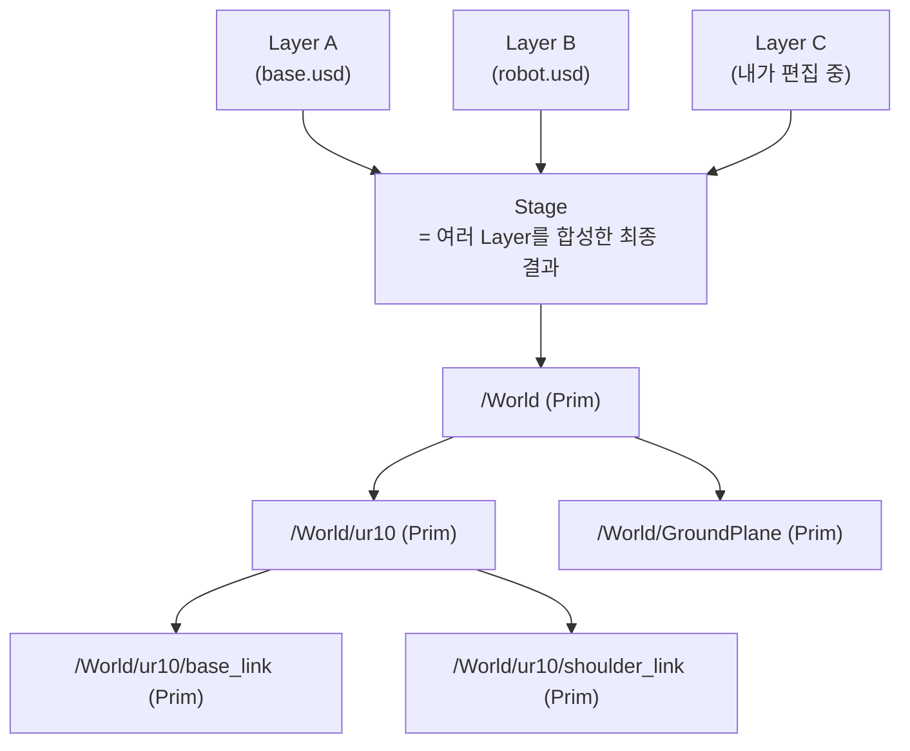
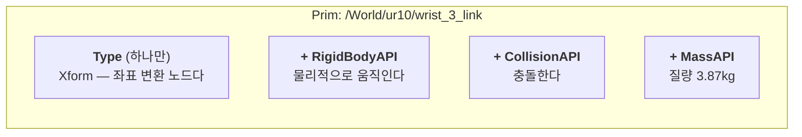
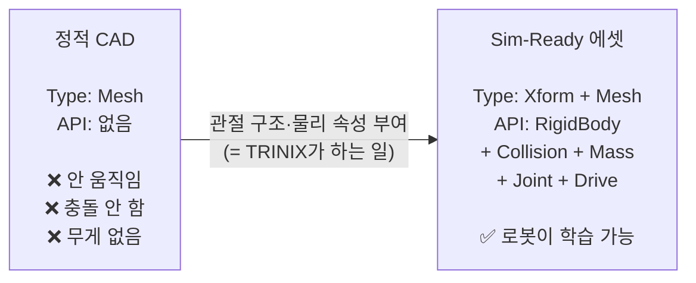
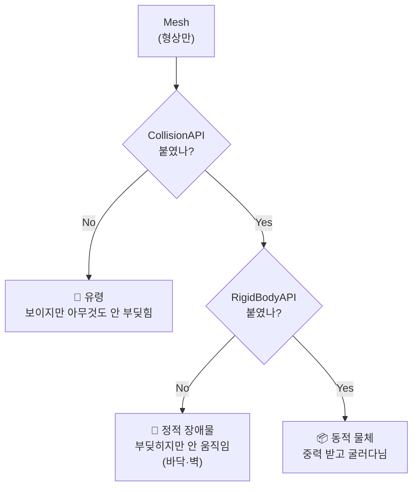
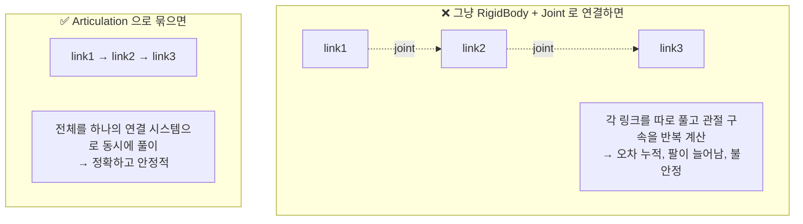
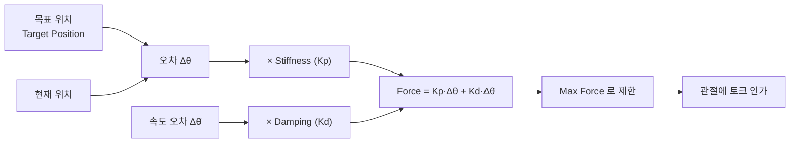
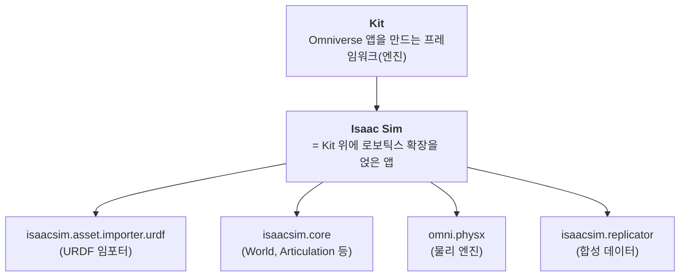

# Isaac Sim 핵심 개념 정리 — 문서가 안 알려주는 것들

## 이 문서를 읽기 전에 — 렌더링해서 봐라

이 문서에는 표와 mermaid 다이어그램이 있다. **raw 텍스트로 보면 안 읽힌다.**

- **GitHub** — 표·mermaid 둘 다 자동 렌더링. 가장 확실하다
- **VS Code** — `Ctrl+Shift+V` 로 미리보기. **mermaid는 확장 설치 필요**
  (`Ctrl+Shift+X` → `Markdown Preview Mermaid Support` 검색 → 설치)

---

## 왜 Isaac Sim 문서가 어려운가

한 문장 안에 **세 가지 출신의 용어**가 섞여 있는데, 아무도 그 경계를 설명해주지 않는다.

| 출신 | 용어 예시 | 정체 |
|---|---|---|
| **USD** (Pixar) | Prim, Stage, Schema, Xform, Layer | 씬을 **기술하는 데이터 포맷** |
| **PhysX** (NVIDIA) | RigidBody, Articulation, Solver, Collider | 물리를 **계산하는 엔진** |
| **Kit** (Omniverse) | Extension, App, Experience, Fabric | 애플리케이션 **프레임워크** |

이 세 축을 분리해서 보면 갑자기 읽힌다. 이 문서가 그 분리를 해준다.

---

# PART 1. USD — 씬을 기술하는 언어

## 1-1. Stage / Prim / Layer



| 용어 | 오해하기 쉬운 것 | 실제 |
|---|---|---|
| **Prim** | "primitive니까 큐브·구 같은 도형?" | ❌ **아니다.** 씬 트리의 **노드 하나**를 뜻한다. 폴더일 수도, 로봇일 수도, 카메라일 수도 있다 |
| **Stage** | "무대? 화면?" | 여러 Layer를 **합성한 결과물 전체**. 지금 보고 있는 씬 |
| **Layer** | "포토샵 레이어?" | 비슷하다. `.usd` 파일 하나 = Layer 하나. 위 Layer가 아래를 덮어쓴다 |
| **Path** | | 프림의 주소. `/World/ur10/base_link` — 파일 경로처럼 생겼지만 **씬 내부 주소**다 |

> **MotoSim에 비유하면** — Stage = 셀 전체, Prim = 트리에 보이는 각 항목(로봇·툴·지그),
> Layer = 여러 사람이 각자 만든 파일을 겹쳐서 하나의 셀로 보는 것.

## 1-2. Schema와 API — 여기가 제일 헷갈린다

USD 문서에 **Schema**, **Applied API**, **Typed Schema** 가 나오는데 설명이 불친절하다.

**핵심 한 줄: 프림은 "무엇인가(type)"와 "무엇을 할 수 있는가(API)"를 따로 갖는다.**



| 구분 | 개수 | 의미 | 예시 |
|---|---|---|---|
| **Typed Schema** (type) | **하나** | 이 프림이 **무엇인가** | `Xform`, `Mesh`, `Camera`, `Scope` |
| **Applied API Schema** | **여러 개** | 이 프림이 **무슨 능력을 갖는가** | `RigidBodyAPI`, `CollisionAPI`, `MassAPI`, `DriveAPI` |

**비유** — Type은 "이것은 자동차다", API는 "여기에 에어컨·썬루프·네비를 옵션으로 달았다".

### 왜 이 구조가 중요한가 — 엔닷라이트의 사업이 바로 이것이다



기사의 *"컨베이어벨트는 돌지 않고, 폴딩폰은 접히지 않는다"* 가 정확히
**왼쪽 상태**를 말한 것이다. Mesh는 있는데 API가 없다.

### 코드에서 보면
```python
from pxr import UsdPhysics

# "이 프림에 질량 능력을 붙인다"
mass_api = UsdPhysics.MassAPI.Apply(prim)   # ← Apply 가 API를 붙이는 동작
mass_api.GetMassAttr().Set(5.0)             # ← 붙인 뒤에야 속성 접근 가능
```
> 오늘 payload를 구현할 때 쓴 코드가 이거다. `.Apply()` 를 안 하고
> `GetMassAttr()` 을 부르면 없는 속성이라 실패한다.

## 1-3. Xform — 좌표 변환

`Xform` = **Transform**의 줄임. 위치·회전·스케일을 갖는 노드.

```
/World/ur10           Xform  ← 로봇 전체의 위치
  └ base_link         Xform  ← 베이스의 상대 위치
      └ visual        Mesh   ← 실제 형상
```

**부모의 변환이 자식에 누적된다.** 로봇 전체를 옮기려면 최상위 Xform만 옮기면 된다.

---

# PART 2. 물리 — PhysX가 계산하는 것

## 2-1. 물리 객체가 되려면 뭐가 필요한가



**STEP 1 실습의 예측 문제 답이 여기 있다.**

| API 조합 | 결과 |
|---|---|
| Mesh만 | 보이기만 함. Play해도 그대로 |
| Mesh + Collision | 바닥·벽 역할. 다른 물체가 부딪힘. 자기는 안 움직임 |
| Mesh + Collision + RigidBody | 떨어지고 굴러감 |
| Mesh + RigidBody (**Collision 없음**) | 떨어지는데 **바닥을 통과한다** |

## 2-2. Collider 근사 — 왜 형상 그대로 안 쓰나

PhysX는 **볼록(convex) 형상**에서 훨씬 빠르게 충돌을 계산한다.
오목한 메시는 그대로 못 쓰고 근사하거나 분해해야 한다.

```
원본 (오목한 그리퍼)      Convex Hull            Convex Decomposition
                                                  
    ┌─┐   ┌─┐            ┌─────────┐              ┌─┐   ┌─┐
    │ │   │ │            │         │              │ │   │ │
    │ └───┘ │     →      │         │      또는    │ └─┬─┘ │
    └───────┘            └─────────┘              └───┴───┘
    
  손가락 사이 빈틈       빈틈이 메워짐            조각으로 나눠 형상 유지
  (물건을 잡아야 함)     ❌ 물건을 못 잡음         ✅ 잡을 수 있음 (무겁다)
```

| 방식 | 정확도 | 속도 | 언제 |
|---|---|---|---|
| **Bounding Cube/Sphere** | 최저 | 최고 | 충돌이 대충만 맞으면 되는 링크 |
| **Convex Hull** | 중간 | 빠름 | **기본값.** 대부분의 로봇 링크 |
| **Convex Decomposition** | 높음 | 느림 | 그리퍼 손가락처럼 오목이 중요한 곳 |
| **Triangle Mesh** | 최고 | 최저 | 정적 환경(바닥·벽)에만. 동적 물체엔 못 씀 |

> **면접 포인트** — "Convex Hull이 기본인 이유"를 물으면
> **정확도와 연산량의 트레이드오프**이고, **링크마다 다르게 줄 수 있다**고 답하면 된다.

## 2-3. Physics Scene

씬에 하나 있는 **전역 물리 설정 프림**. 여기서 정하는 것:
- 중력 방향·크기
- 솔버 종류 (TGS / PGS)
- 시간 스텝(dt), 서브스텝 수

> **오늘의 26ms 지연과 연결** — `dt = 1/120초 = 8.33ms` 가 여기서 정해진다.
> STEP 7 과제 3(240Hz 실험)이 이 값을 바꾸는 것이다.

---

# PART 3. 로봇 — Articulation

## 3-1. Articulation이 뭐고 왜 필요한가

**"관절로 연결된 강체들을 하나의 단위로 푸는 것."**



**이게 왜 중요한가** — 6축 로봇을 개별 강체로 만들면 팔이 축 늘어지거나 떨린다.
Articulation으로 묶어야 산업용 로봇처럼 강건하게 동작한다.

## 3-2. ArticulationRootAPI 는 어디에 붙나

**로봇 트리의 최상위 프림**에 붙인다. "여기서부터 아래는 한 덩어리다"라는 선언.

```
/World/ur10                    ← ★ ArticulationRootAPI 여기
  ├ base_link                    (RigidBodyAPI)
  ├ shoulder_link                (RigidBodyAPI)
  ├ shoulder_pan_joint           (RevoluteJoint + DriveAPI)
  ├ upper_arm_link               (RigidBodyAPI)
  ├ shoulder_lift_joint          (RevoluteJoint + DriveAPI)
  └ ...
```

> **STEP 0 자가진단 2번의 답이 이것이다.** 각 링크가 아니라 **최상위**다.

## 3-3. Joint 종류

| USD 타입 | 자유도 | 예시 |
|---|---|---|
| `PhysicsRevoluteJoint` | 회전 1 | 로봇 관절 대부분, 문 경첩 |
| `PhysicsPrismaticJoint` | 직선 1 | 그리퍼 손가락, **서랍**, 리니어 액추에이터 |
| `PhysicsFixedJoint` | 0 | 툴 장착, 베이스 고정 |
| `PhysicsSphericalJoint` | 회전 3 | 볼조인트 |

> **엔닷라이트 맥락** — 서랍 = Prismatic, 문 = Revolute, 컨베이어 = Revolute(무한회전).
> 정적 CAD에 **어떤 Joint를 어디에 어느 축으로** 붙일지 정하는 게 Sim-Ready 변환의 핵심이다.

## 3-4. Drive — 관절의 제어기 ★

**여기가 오늘의 주제였다.**



| 속성 | 역할 | 오해 |
|---|---|---|
| **Stiffness** | Kp. 목표로 **당기는** 힘 | 높을수록 좋은 게 아니다. 수치 불안정 |
| **Damping** | Kd. 속도에 **저항**하는 힘 (브레이크) | URDF의 `<dynamics damping>` 과 **다른 것** |
| **Max Force** | 낼 수 있는 최대 토크 | 여기에 걸리면 게인을 올려도 소용없다 |
| **Target Position** | 목표 각도 | 여기에 명령을 준다 |
| **Drive Type** | Position / Velocity / **None(토크)** | **None이면 stiffness/damping이 0으로 무시된다** |

### ⚠️ 이름이 같아서 헷갈리는 것 — damping 두 개

```
URDF <dynamics damping="0.5"/>          Drive > Damping (Kd)
      ↓                                        ↓
관절 자체의 점성 마찰                     제어기의 D 게인
(베어링·그리스)                           (오버슈트 억제)
로봇 전원 꺼도 존재                       전원 끄면 사라짐
= 하드웨어 물성                           = 제어 설정
```

**면접에서 "URDF에 damping 있는데 왜 또 넣나요"의 답이 이 표다.**

---

# PART 3.5. URDF Importer 옵션 전체 해부

임포트 창을 그냥 넘기면 나중에 원인을 못 찾는 문제가 생긴다.
각 항목이 무엇을 정하는지, 왜 그 값인지 정리한다.

## 먼저 — URDF 임포터가 두 개인 이유

익스텐션 목록에 비슷한 게 두 개 보인다. **차이는 "어디서 URDF를 가져오는가" 하나뿐이다.**

| | `isaacsim.asset.importer.urdf` | `isaacsim.ros2.urdf` |
|---|---|---|
| 입력 | 디스크의 **`.urdf` 파일** | 실행 중인 **ROS 2 노드** |
| 메뉴 | `File > Import` | `File > Import from the ROS 2 URDF Node` |
| 지정 대상 | 파일 경로 | 노드 이름 (`robot_state_publisher`) |
| 사전 준비 | 없음 | ROS 2 설치 + 패키지 빌드 + `ros2 launch` |
| **플랫폼** | Windows OK | **Linux 전용** |

임포터가 하는 일 자체는 같다. **URDF 텍스트를 어디서 받아오느냐**만 다르다.

### 왜 ROS 2 경로가 존재하는가 — xacro 때문이다

실제 로봇 패키지(UR·Franka 등)는 `.urdf` 가 아니라 **`.xacro`** 로 배포된다.
매크로·변수·조건문이 들어있어 그대로는 임포트가 안 된다.

```
xacro (매크로 언어)  ──[전개]──▶  urdf (평평한 XML)
   ur.urdf.xacro                    Isaac Sim이 읽을 수 있는 형태
   + ur_type:=ur10e
```

ROS 2 시스템에서는 `robot_state_publisher` 가 이 전개를 이미 해서
`/robot_description` 으로 뿌린다. 거기서 받으면 **xacro 전개와 경로 해석을 ROS에 떠넘길 수 있다.**

**공식 튜토리얼이 이 대비를 그대로 보여준다** —
UR10e 팔은 ROS 2 노드에서 받지만, Robotiq 그리퍼는 ROS1용 deprecated 패키지라
노드로 못 띄우고 **손으로 변환해야 한다.**

> `$(find robotiq_2f_140_gripper_visualization)` → **상대 경로로 변경**
> `package://` → **상대 경로로 변경**
> `xacro robotiq_arg2f_140_model.xacro > robotiq_2f_140.urdf`

NVIDIA 공식 문서조차 이 수작업을 피하지 못했다. ROS 2 경로의 가치가 여기서 드러난다.

### 어느 쪽을 쓸 것인가

| 상황 | 방법 |
|---|---|
| **평평한 `.urdf` 파일이 이미 있다** | **`File > Import`** ← 임포터 동봉 로봇, Windows 환경 |
| xacro만 있고 ROS 2 환경이 있다 (Linux) | ROS 2 노드 경유 |
| xacro만 있고 ROS가 없다 | 손으로 xacro 전개 + 경로 수정 (고생) |

> **Sim-to-Real 관점의 의미** — ROS 2 경로는 **실기와 시뮬이 같은 로봇 정의를 쓰도록** 보장한다.
> 파일을 복사해두면 실기 쪽 URDF가 바뀌었을 때 시뮬이 옛날 걸 쓰게 되는데,
> 토픽에서 직접 받으면 그 불일치가 원천 차단된다.
> 물성값 불일치와 마찬가지로 **모델 정의 불일치도 갭의 원인**이다.

> 세 번째로 보이는 `isaacsim.asset.exporter.urdf` 는 **반대 방향**이다 (USD → URDF).
> Isaac Sim에서 만든 로봇을 ROS 쪽으로 넘길 때 쓴다.

## 창 구조 — 세 가지를 묻고 있다

```
┌─ cobotta_pro_900.urdf ──────────────────────────┐
│                                                  │
│ ▼ Options                                        │
│                                                  │
│ ▼ Model ──────────────── 어떻게 저장할까          │
│   ○ Create in Stage    ● Referenced Model        │
│   USD Output: Same as Imported Model             │
│                                                  │
│ ▼ Links ──────────────── 베이스와 질량            │
│   ○ Moveable Base      ● Static Base             │
│   Default Density      [ 0.0 ] Kg/m³             │
│                                                  │
│ ▼ Joints & Drives ────── ★ URDF에 없는 제어값     │
│   ☐ Ignore Mimic                                 │
│   Joint Configuration                            │
│     ○ Stiffness        ● Natural Frequency       │
│   Drive Type                                     │
│     ○ Acceleration     ● Force                   │
│   ┌──────────────┬─────────┬────────┬─────────┐  │
│   │ Name         │ Target  │ Nat.Fq │ Damp.R  │  │
│   ├──────────────┼─────────┼────────┼─────────┤  │
│   │ finger_joint │Position │  25.0  │  0.005  │  │
│   │ joint_1      │Position │  25.0  │  0.005  │  │
│   │ joint_2 …    │Position │  25.0  │  0.005  │  │
│   └──────────────┴─────────┴────────┴─────────┘  │
│                                                  │
│ ▼ Colliders ──────────── 충돌 형상 근사           │
│   ☐ Collision From Visuals                       │
│   ● Convex Hull        ○ Convex Decomposition    │
│   ☐ Allow Self-Collision                         │
│   ☐ Replace Cylinders with Capsules              │
└──────────────────────────────────────────────────┘
```

| 그룹 | 묻는 것 | URDF에 있나 |
|---|---|---|
| Model / Links | 저장 방식, 베이스 고정 | 있음 (일부) |
| **Joints & Drives** | **제어값 Kp·Kd** | **없음 ← 여기가 핵심** |
| Colliders | 충돌 형상 근사 방법 | 있지만 근사 필요 |

---

## Joints & Drives — 제어값

### Natural Frequency 모드의 변환식

Kp·Kd를 직접 넣는 대신, 물리적으로 의미 있는 두 값으로 지정한다.

```
Kp = m · ωn²
Kd = 2 · m · ζ · ωn

  m  = 그 관절의 등가 관성 (equivalent inertia)
  ωn = Natural Frequency   ← 얼마나 빠르게 반응할까
  ζ  = Damping Ratio       ← 얼마나 안정적으로 수렴할까
```

**왜 이 방식이 나은가** — Kp를 직접 넣으면 *"이 관절엔 10000이 적당한가?"* 를 알 수 없다.
관절마다 관성이 다르므로 어깨와 손목에 같은 Kp를 주면 거동이 완전히 달라진다.
ωn·ζ는 **"얼마나 빠르게, 얼마나 안정적으로"** 라는 목표를 직접 말하는 것이고,
등가 관성 m은 임포터가 곱해준다. 관절 크기가 달라도 같은 응답 특성이 나온다.

> 저장은 결국 **Stiffness 값으로** 된다. ωn·ζ는 입력을 위한 표현일 뿐이다.

### ζ (Damping Ratio) 읽는 법

| ζ | 상태 | 거동 |
|---|---|---|
| **1.0** | 임계감쇠 | 오버슈트 없이 가장 빠르게 수렴 |
| **< 1.0** | 부족감쇠 | 오버슈트·진동 |
| **> 1.0** | 과감쇠 | 진동 없지만 느림 |

### ★ 기본값 ωn=25 는 너무 낮다 — NVIDIA 자신은 300을 쓴다

임포트 창 기본값은 **ωn = 25, ζ = 0.005** 다. 그런데 공식 매니퓰레이터 셋업 튜토리얼
([Tutorial 6: Setup a Manipulator](https://docs.isaacsim.omniverse.nvidia.com/5.1.0/robot_setup_tutorials/tutorial_import_assemble_manipulator.html))
은 UR10e를 임포트할 때 이렇게 지시한다.

> **"Natural Frequency를 300으로 설정하여 조인트가 충분히 경직되도록 보장"**

그리고 그리퍼의 mimic 관절은 **2500** 을 쓴다.

`Kp = m·ωn²` 이므로 강성으로 환산하면 차이가 크다.

| ωn | Kp | 기본값 대비 |
|---:|---:|---:|
| **25** (임포터 기본값) | 625 m | 1× |
| **300** (튜토리얼 권장) | 90,000 m | **144×** |
| **2500** (mimic 관절) | 6,250,000 m | 10,000× |

**P1 스윕 결과와 정확히 맞물린다.** stiffness 1,000 → 100,000 으로 올렸을 때
중력 처짐이 97% 줄었는데, 기본값 ωn=25 는 그 스윕의 **맨 아래쪽 구간**에 해당한다.
처지는 게 당연한 값이었다.

### ζ = 0.005 는 방치된 기본값이 아니라 NVIDIA의 관례로 보인다

임계감쇠(ζ=1.0)의 **1/200 수준**이다.

```
ζ=1.0 (임계감쇠)   Kd = 2 · m · 1.0   · ωn
ζ=0.005 (기본값)   Kd = 2 · m · 0.005 · ωn      ← 1/200
```

이론대로면 심하게 출렁여야 한다. 그런데 **공식 튜토리얼도 mimic 관절에 ζ = 0.005 를 쓴다.**
즉 실수나 방치가 아니라 의도적 선택으로 보인다.

**왜 그런지는 단정하지 않는다.** 정황은 이렇다 — ωn 을 크게 올리고 ζ 는 낮게 두는 조합을 쓰며,
위치 제어에서 중요한 건 목표 추종(Kp)이고 실제 안정성은 관절 마찰과 솔버 감쇠가 보완하는 것으로 보인다.

### 직접 확인할 것 — 이제 비교 기준이 있다

| 조합 | 예상 | 실측 |
|---|---|---|
| ωn=25, ζ=0.005 (임포터 기본) | 처짐 큼 | [ ] |
| **ωn=300, ζ=0.005 (NVIDIA 권장)** | 처짐 작음, 진동은? | [ ] |
| ωn=300, ζ=1.0 | 처짐 작고 진동 없음, 대신 느림 | [ ] |

세 조합을 돌려보면 **"왜 NVIDIA는 ζ를 안 올리고 ωn만 올리는가"** 에 대한 실측 근거가 생긴다.
면접에서 *"기본값을 그대로 쓰셨나요?"* 가 나올 때 쓸 수 있는 종류의 답이다.

### Drive Type — Acceleration vs Force ★ 가장 중요

공식 원문:
> **Acceleration** drives *normalize the inertia before applying the effort, making it
> invariant to changes in robot mass (payload not included), equivalent to ideal damped actuator.*
> In **force** drives, *the effort is applied directly to the joint, equivalent to a spring-damper system.*

| | **Force** | **Acceleration** |
|---|---|---|
| 동작 | 계산한 힘을 관절에 **그대로** 인가 | 관성으로 **나눈 뒤** 인가 |
| 비유 | 실제 스프링-댐퍼 | 이상적인 감쇠 액추에이터 |
| 질량이 바뀌면 | **게인 재조정 필요** | 게인 그대로 |
| 물리적 현실성 | 높음 | 낮음 (이상화) |

**무빙실러 payload 사례와 연결** — 질량이 바뀌면 같은 게인으로 같은 거동이 안 나오는 것,
그게 **Force 드라이브의 세계**다. Acceleration은 그 의존성을 없앤다.

다만 괄호를 잘 볼 것 — **"(payload not included)"**.
로봇 자체 관성은 정규화하지만 **집어든 물건의 무게는 여전히 외란**이다.
즉 Acceleration을 써도 payload 문제는 남는다.

**선택 기준**

| 목적 | 선택 | 이유 |
|---|---|---|
| **Sim-to-Real 검증** | **Force** | 실기와 같은 구조여야 갭을 측정할 수 있다 |
| **RL 학습** | Acceleration | 도메인 랜덤화로 질량을 흔들어도 게인 재조정 불필요 |

### ★ "제조사가 준 게인을 넣으면 되지 않나?" — 자주 나오는 질문

**물리 파라미터와 제어 게인은 성격이 다르다.**

#### 제조사 값을 그대로 써야 하는 것 — 물리 파라미터

| 항목 | 출처 | URDF |
|---|---|---|
| 관절 가동범위 | 데이터시트 | `<limit lower upper>` |
| 최대 속도 | 데이터시트 | `<limit velocity>` |
| 최대 토크 | 데이터시트 | `<limit effort>` |
| 링크 질량·관성 | 제조사 CAD | `<inertial>` |

실측·규격값이므로 **지어내면 안 된다.** URDF에 들어있고 건드리지 않는다.

#### drive gain은 다르다 — 로봇의 물성이 아니라 모델링 선택

제조사가 주지 않는 이유가 세 가지다.

**① 실제 컨트롤러는 단순 PD가 아니다**
```
위치 루프 → 속도 루프 → 전류 루프
  (~1kHz)   (~4kHz)    (~8kHz)
      +
중력보상 · 마찰보상 · 관성 디커플링 · 가속도 피드포워드
```
다단 캐스케이드에 보상항이 여러 겹이다. 여기서 "Kp 하나"를 뽑아낼 수 없다.
PhysX 드라이브는 물리 스텝(120Hz)에서 도는 **단일 PD**라 구조 자체가 다르다.

**② 공개하지 않는다**
컨트롤러 게인은 독점 자산이다. 티칭 펜던트에서 만질 수 있는 건 payload·TCP·속도 배율이지 게인이 아니다.

**③ 시뮬 관성이 실물과 다르다**
`Kd = 2·m·ζ·ωn` 의 `m` 은 **시뮬의 등가 관성**이다. URDF `<inertial>` 은 근사값인 경우가 많고
관성 텐서를 대각으로 뭉갠 URDF도 흔하다. 실물 게인을 그대로 넣어도 m이 다르면 다른 거동이 나온다.

#### 실제 표준 — 게인을 복사하지 않고 응답을 맞춘다

```
❌ 제조사 Kp 를 시뮬에 복사
✅ 실기 응답을 측정 → 시뮬 응답이 그걸 따라가도록 게인을 동정(system identification)
```

목표는 **"같은 숫자"가 아니라 "같은 거동"** 이다. 측정 대상:
- 계단 입력에 대한 정착 시간·오버슈트
- 궤적 추종 오차
- 중력 부하에서의 정상상태 처짐

> 이것이 정확히 엔닷라이트가 말한 루프다 —
> *"가상 설정값과 실제 측정값 비교 → 물성값 조정 → 재생성 및 재검증"*

#### 더 깊이 — Actuator Network

RL 쪽에서는 더 밀어붙인다. ANYmal 팀은 **실기 액추에이터의 입출력 데이터를 모아
신경망으로 액추에이터 모델 자체를 학습**시켰다. PD 게인으로는 못 잡는 마찰·백래시·전류 포화를
데이터로 흡수한 것이다.

Isaac Lab에 `ImplicitActuator`, `DCMotor` 같은 액추에이터 모델이 따로 있는 이유가 이것 —
**"게인 두 개로는 실제 액추에이터를 다 표현 못 한다"** 는 인식이 프레임워크 설계에 반영돼 있다.

#### 면접 답변 뼈대

> "가동범위·최대토크·질량 같은 물리 파라미터는 제조사 규격을 그대로 씁니다.
> 하지만 drive gain은 로봇의 물성이 아니라 시뮬레이터 모델링 선택이라 성격이 다릅니다.
> 실제 컨트롤러는 다단 캐스케이드에 보상항이 여러 겹이라 PhysX의 단일 PD로 등가 변환할 수 없고,
> 제조사도 공개하지 않습니다. 그래서 게인을 복사하는 게 아니라 **실기 응답을 측정해서
> 시뮬 응답이 그걸 따라가도록 동정**하는 게 맞다고 봅니다."

---

### Ignore Mimic

> *"If checked, the Mimic tag will be ignored on import. Otherwise joints with the mimic tag
> will receive the PhysX Mimic API, allowing it to work in tandem with the primary joint."*

URDF `<mimic>` 은 **한 관절이 다른 관절을 따라가게** 묶는 태그다.
그리퍼에서 흔하다 — 손가락 하나만 구동하고 반대쪽은 대칭으로 따라가게.

**그리퍼가 있으면 체크를 풀어둔다.** 체크하면 한쪽만 움직인다.

---

## Links

### Static Base vs Moveable Base

> *"Choose between a **Moveable base** (for example, a wheeled robot) or a **Static base**
> (for example, a 6DoF robotic arm). If the robot is a static base, the base link will be
> fixed in place with a `root_joint`."*

6축 로봇팔 → Static. 모바일 로봇·휴머노이드 → Moveable.

> 여기서 생성되는 `root_joint` 가, 로그에 나오는
> `prim '/ur10/root_joint' was deleted...` 경고의 그 프림이다.

### Default Density

> *"used for links that do not have a mass specified in the URDF. If the density is set to `0`,
> the physics engine will automatically compute the density with its default value."*

URDF에 `<inertial>` 이 제대로 있으면 안 쓰인다. **0이 기본이고 그게 맞다** (URDF 값을 신뢰).

**주의** — URDF에 질량이 빠진 링크가 있으면 이 값이 대신 쓰인다.
그 값이 실제와 다르면 **조용히 틀린 물리**가 된다.
임포트 후 콘솔에 질량 관련 경고가 없는지 확인하는 습관을 들일 것.

---

## Model — 저장 방식

| | Create in Stage | **Referenced Model** |
|---|---|---|
| 저장 | 현재 씬 안에 직접 | **별도 USD 파일**로 만들고 참조 |
| 씬 파일 | 무거워짐 | 가벼움 |
| 재사용 | 어려움 | 여러 씬에서 같은 로봇 참조 |
| 수정 | 씬마다 따로 | **원본 고치면 전부 반영** |

**Referenced가 실무 표준.** 로봇 10대짜리 라인을 생각하면 명확하다 —
Create in Stage면 로봇 데이터가 10벌 복사되고, 모델을 고치면 10군데를 고쳐야 한다.

> MotoSim에서 로봇 모델을 라이브러리에서 불러 쓰던 것과 같은 개념이다.

---

## Colliders

### Collision From Visuals

> *"If checked, the collision objects will be created from the visual meshes when a
> collision object is not provided."*

URDF에 `<collision>` 이 있으면 그걸 쓴다. **끄는 게 기본** —
비주얼 메시는 렌더링용이라 폴리곤이 많아 충돌 계산이 무겁다.

### Convex Hull vs Convex Decomposition

> **Convex Hull**: *"will create a single convex hull around the collision mesh"*
> **Convex Decomposition**: *"will create multiple convex hulls around the collision mesh
> to better match the visual asset"*

#### ★ 중요 — Hull은 **링크 하나하나에 개별로** 적용된다

흔한 오해: *"그리퍼에 Convex Hull을 쓰면 손가락 사이가 메워진다"* → **틀렸다.**

2지 그리퍼는 보통 손가락 하나하나가 **별개의 링크**다. 각 링크가 자기 rigid body와
자기 hull을 갖는다. 손가락 **사이** 공간은 어느 hull의 관할도 아니므로 메워지지 않는다.

```
오해                              실제

  ┌─────────────┐                 ┌─┐     ┌─┐
  │ 하나의 hull  │                 │ │     │ │   ← 링크별 개별 hull
  │ 전체를 감쌈  │                 │ │     │ │
  └─────────────┘                 └─┘     └─┘
                                     ↑ 간격 유지됨
```

> Viewport의 눈 아이콘 → `Show By Type > Physics > Colliders > All` 로 켜면
> collider 형상이 빨간 와이어프레임으로 보인다. `Selected` 로 바꾸고 링크 하나만
> 선택하면 그 링크의 hull만 볼 수 있어 원본과 얼마나 다른지 바로 확인된다.
>
> 같은 메뉴의 `Simplify at Distance` 는 **렌더링 옵션**이다 (멀어지면 표시 단순화).
> 물리에는 영향 없다.

#### 그럼 Convex Hull이 실제로 문제가 되는 때는

**하나의 링크 자체가 오목할 때**다. "그리퍼라서 위험"이 아니라 **"링크 형상이 오목해서 위험"**.

| 링크 형상 | Convex Hull 결과 |
|---|---|
| 단순 사각기둥 손가락 | 문제 없음. hull ≈ 원본 |
| 안쪽에 **갈고리·곡면** 파지면이 있는 손가락 | **오목한 안쪽이 메워짐** → 접촉점이 바깥으로 밀림 |
| 그리퍼 전체가 **한 링크**로 모델링됨 | 두 갈래 사이가 메워짐 (CAD 임포트에서 발생) |
| C자 브래킷, 컵·트레이 안쪽 | 안쪽 공간이 사라짐 |

해당하는 **그 링크만** Convex Decomposition으로 바꾼다 (전체를 바꾸면 무겁다).

### Allow Self-Collision

> *"Enables self collision between adjacent links. **It may cause instability if the collision
> meshes are intersecting at the joint.**"*

문서가 직접 불안정을 경고한다. 관절 부위에서 인접 링크의 충돌 메시가 겹치는 게 흔하고,
그러면 시뮬 시작하자마자 로봇이 튕겨나간다. **꺼둔다.**

### Replace Cylinders with Capsules

> *"cylinder colliders will be replaced with capsule primitives."*

PhysX에서 **실린더는 기본 도형이 아니라** 내부적으로 볼록 메시로 근사된다.
캡슐은 기본 도형이라 **충돌 계산이 빠르고 수치적으로 안정적**이다.

대신 모서리가 둥글어져 형상이 미세하게 달라진다.
원통형 링크가 많으면 켜볼 만하고, 정밀 접촉이 중요하면 끈다.

---

# PART 3.6. 팔 + 툴 조립 — Robot Assembler와 Variants

실제 현장에서 로봇과 툴은 **항상 따로 온다.** 로봇은 야스카와, 그리퍼는 슈멀츠,
실러건은 또 다른 데서 온다. 그래서 임포트는 시작일 뿐이고 **조립**이 남는다.

## Robot Assembler

`Tools > Robotics > Asset Editor > Robot Assembler`

별도 USD 두 개를 불러다 부착점을 지정하면 조인트를 자동으로 만들어준다.

| 설정 항목 | 예시 |
|---|---|
| Base Robot / Attach Point | `/ur` / `wrist_3_link` |
| Attach Robot / Attach Point | `/ur/ee_link` / `robotiq_arg2f_base_link` |
| Assembly Namespace | `ee_link` |

절차: **Begin Assembling Process** → 방향 조정(예: Z +90) → **Assemble and Simulate**
→ **End Simulation And Finish**

### 수동으로 하면 이만큼 해야 한다

Assembler 없이 하려면 공식 튜토리얼 기준으로:

1. 그리퍼 USD를 드래그 앤 드롭, 프림 이름을 `ee_link` 로 변경
2. 좌표를 손으로 입력 — `Translate (1.18425, 0.2907, 0.06085)`, `Orient (-90, 0, -90)`
3. FixedJoint 생성 후 `Body0` 을 `/ur/wrist_3_link` 로 지정
4. `isaac:physics:robotJoints`, `isaac:physics:robotLinks` 필드에 `/ur/ee_link` 추가

> 4번을 빠뜨리면 **두 로봇이 하나의 articulation으로 인식되지 않는다.**
> 붙어는 있는데 관절 제어가 따로 노는 상태가 된다. 흔한 함정이다.

> **MotoSim에 비유하면** — 툴을 로봇 플랜지에 마운트하고 TCP를 잡던 그 작업이다.
> 좌표를 손으로 넣는 것도, 툴 정의를 로봇에 등록하는 것도 구조가 같다.

## Variants — 하나의 에셋에 여러 구성

USD의 **VariantSet** 기능이다. 에셋 하나 안에 여러 구성을 담아두고 스위치로 고른다.

튜토리얼에서는 그리퍼를 **payload로** 붙여서, Property Editor의 Variants 섹션에서
`ee_link` 를 전환할 수 있게 만든다.

| 선택 | 결과 |
|---|---|
| `None` | 그리퍼 제거 |
| `robotiq_2f_140` | 그리퍼 장착 |

> *"Depending on the variant selected, the gripper will be added as a payload,
> which allows us to load or unload the different end effectors"*

### ★ 엔닷라이트 맥락에서 중요한 개념이다

기사에서 대표가 로봇 제조사 수요를 이렇게 설명했다.

> **"형태 비슷하되 조금씩 다른 대량의 변형 데이터"**

**Variant가 정확히 그걸 담는 USD 메커니즘이다.** 파일을 100개 복사하는 대신
하나의 에셋에 변형을 담고 스위치로 고른다. Sim-Ready 에셋을 파는 회사라면 반드시 쓰는 기능이다.

면접에서 *"변형 데이터를 어떻게 관리할 것 같나요"* 라는 질문이 나오면 여기서 답이 나온다.

---

# PART 4. 소프트웨어 구조 — Kit / Extension / World

## 4-1. Omniverse 앱 구조



| 용어 | 의미 |
|---|---|
| **Kit** | 앱 프레임워크. Isaac Sim·USD Composer 등이 모두 Kit 위에 있다 |
| **Extension** | 기능 플러그인. `Window > Extensions` 에서 켜고 끈다 |
| **Experience (`.kit` 파일)** | "어떤 Extension들을 켜서 앱을 구성할지" 정의한 레시피 |

> `isaacsim isaacsim.exp.full.kit` 처럼 실행하는 걸 본 적 있다면,
> 저 `.kit` 이 Experience 파일이다.

## 4-2. World vs Stage — 실전에서 제일 헷갈리는 쌍

```
USD Stage                          Isaac Sim World
─────────────────                  ─────────────────
"씬에 뭐가 있나"                    "시뮬레이션을 어떻게 돌리나"
프림 트리, 속성                     물리 스텝, 리셋, 시간 관리
pxr.Usd 계열 API                   isaacsim.core.api 계열 API

omni.usd.get_context()             World(physics_dt=1/120)
   .get_stage()                    world.reset()
                                   world.step()
```

**Stage는 데이터, World는 실행기.** 같은 씬을 다른 관점에서 다루는 것이다.

## 4-3. Articulation 관련 클래스가 두 개인 이유

오늘 에러가 났던 지점이다.

| 클래스 | 대상 | 쓰는 곳 |
|---|---|---|
| `SingleArticulation` | 로봇 **한 대** | 일반 스크립트 |
| `Articulation` (view) | 로봇 **여러 대 동시** | RL 학습 (수천 개 환경 병렬) |

> Isaac Lab에서 수천 개 로봇을 동시에 학습시킬 때 개별 접근하면 느리다.
> 그래서 **텐서로 한 번에 다루는** view 클래스가 따로 있다.
> 오늘 로그에 나온 `physics.tensors simulationView` 경고가 이 계열이다.

### 메서드 이름 함정
```python
art.set_joint_positions(q)   # ← 순간이동 (텔레포트). 물리 무시하고 상태를 덮어씀
art.apply_action(ArticulationAction(joint_positions=q))  # ← 제어 목표 (드라이브에 명령)
```
**둘은 완전히 다르다.** 앞은 치트, 뒤가 제어다.
초기 자세를 잡을 땐 앞을, 실제 제어할 땐 뒤를 쓴다.

---

# PART 5. 오늘 만난 에러·경고 메시지 해독

| 메시지 | 뜻 | 문제인가 |
|---|---|---|
| `link ee_link has no body properties ... merged into wrist_3_link` | 질량 없는 더미 링크를 앞 링크에 합쳤다 | ❌ 정상. URDF에 좌표용 더미 링크가 흔하다 |
| `Creating Asset in an in-memory stage, will not create layered structure` | 파일로 저장 안 하고 메모리에만 만든다 | ❌ 정상. 스크립트에서 임시로 쓸 때 |
| `omni.isaac.version has been deprecated in favor of isaacsim.core.version` | 구 네임스페이스 사용 중 | ⚠️ 동작은 함. 5.0에서 `omni.isaac.*` → `isaacsim.*` 로 대개편됨 |
| `prim '/ur10/root_joint' was deleted while being used by a tensor view class` | 씬을 지웠는데 참조가 남아있다 | ⚠️ 반복 실행 시 정리 순서 문제 |
| `attribute overrideClipRange not found for bucket id 9` | Fabric 내부 경고 | ❌ 무시해도 됨 |

> **`omni.isaac.*` vs `isaacsim.*`** — 인터넷 예제 코드가 안 돌아가는 가장 흔한 이유다.
> 5.0부터 네임스페이스가 바뀌었다. 옛날 블로그 코드는 `omni.isaac.core` 를 쓴다.

---

# PART 6. 빠른 조회표

| 문서에서 본 말 | 한 줄 해석 |
|---|---|
| Prim | 씬 트리의 노드 하나 |
| Stage | 합성된 씬 전체 |
| Layer | `.usd` 파일 하나 (겹쳐서 합성됨) |
| Xform | 좌표 변환을 갖는 노드 |
| Schema (Typed) | 프림의 "종류" — 하나만 |
| API (Applied) | 프림에 붙이는 "능력" — 여러 개 |
| `.Apply()` | 능력을 붙이는 동작 |
| RigidBody | 물리로 움직이는 강체 |
| Collider | 충돌 판정 형상 |
| Articulation | 관절로 연결된 강체 묶음 |
| ArticulationRoot | 그 묶음의 최상위 표시 |
| Drive | 관절의 PD 제어기 |
| Stiffness / Damping | Kp / Kd |
| Physics Scene | 전역 물리 설정 (중력·dt·솔버) |
| Kit | Omniverse 앱 프레임워크 |
| Extension | 기능 플러그인 |
| Experience (`.kit`) | 어떤 Extension을 켤지 정의한 파일 |
| World | Isaac Sim의 시뮬 실행기 (Stage와 다름) |
| Fabric | 고속 데이터 접근 계층 (USD 우회 캐시) |
| Replicator | 합성 데이터 생성 도구 |
| SimReady | 물리·관절 정보를 갖춘 "바로 시뮬 가능한" 에셋 |
| xacro | URDF를 만들어내는 매크로 언어. 전개해야 임포트 가능 |
| `robot_state_publisher` | xacro를 전개해 `/robot_description` 으로 뿌리는 ROS 2 노드 |
| Robot Assembler | 팔 + 툴을 하나의 articulation으로 합치는 도구 |
| VariantSet / Variant | 에셋 하나에 여러 구성을 담고 스위치로 고르는 USD 기능 |
| Payload | 필요할 때만 로드하는 참조. Variant로 툴 교체할 때 쓰임 |
| Mimic | 한 관절이 다른 관절을 따라가게 묶는 URDF 태그 (그리퍼) |

---

# 면접에서 이 개념들을 엮는 한 문단

> "USD에서 프림은 타입 하나와 여러 API를 갖습니다. CAD를 임포트하면 Mesh 타입 프림만 생기고,
> 물리 API가 없어서 형상만 있는 상태입니다. 여기에 Collision·RigidBody·Mass를 붙이고,
> 움직여야 하는 부분에 Revolute나 Prismatic Joint를 만들고, 제어가 필요하면 Drive를 붙여야
> 비로소 로봇이 학습할 수 있는 Sim-Ready 에셋이 됩니다. 엔닷라이트가 자동화하려는 게
> 정확히 이 과정이라고 이해하고 있습니다."

이 한 문단을 막힘없이 말할 수 있으면 개념 파트는 통과다.
